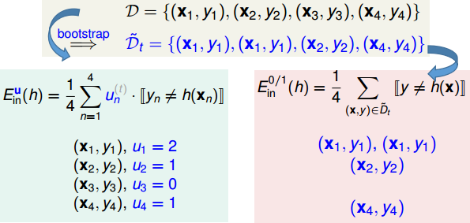
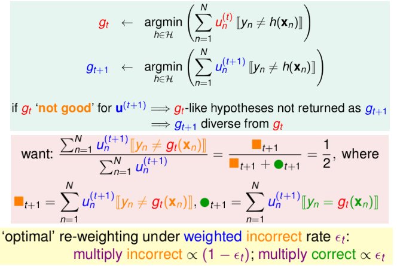
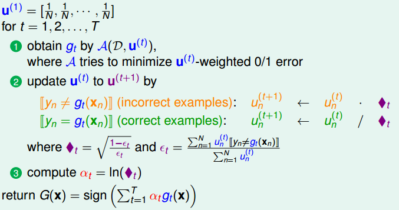
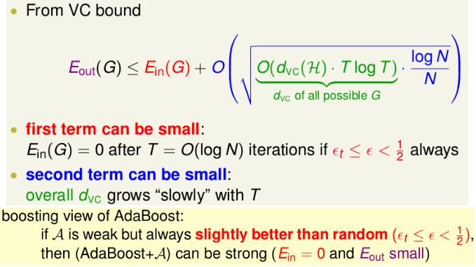

# Adaptive Boosting (AdaBoost)

## 1. 调整权值来体现多样性

通过调整权值，可以起到类似于Bagging的作用：

通过更新权值，可以间接增加假设函数集的多样性((获得不同的最优假设函数)：

（可以多角度看待这个问题：一方面可以视为bagging的角度，另一方面也可以视为给分错的样本更多重视）

## 2. AdaBoost算法

几点核心思想：1. “放大”上次分类错误的样本，“隐藏”上次分类正确的样本 2. 根据每种最佳函数的错误率来对每种权值情况下的最佳函数分配不同的权重 

上述算法的一些可供改变之处：为了避免出现$u^{(t)}\to0$的情况出现，可以在②的最后加上$u/sum(u)$将其始终保持和为1这个情况。

## 3. AdaBoost背后的理论依据

可以根据VC bound理论给出下列结果：

上述结果可以说明AdaBoost的可行性。（其实就是每一个算法都不强，但是"各有所长"，结合起来就秒天秒地）

> 注意：adaboost是一种思想，往往和那些"简单"的方法（如决策树桩）等结合起来，才能发挥其作用

