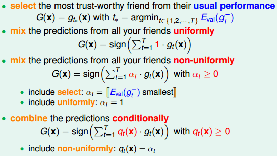
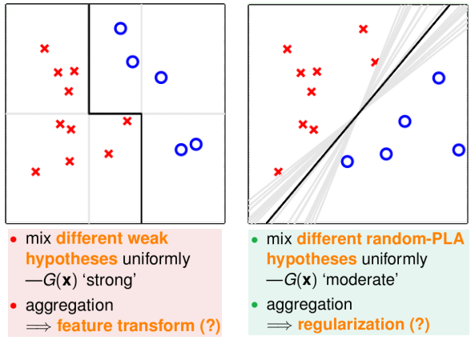
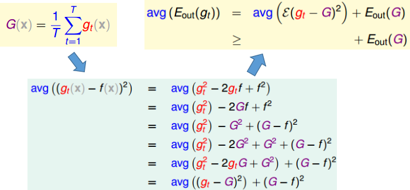
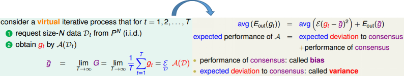
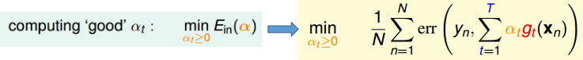
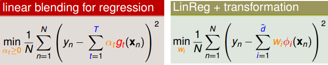
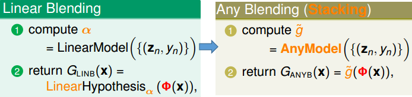
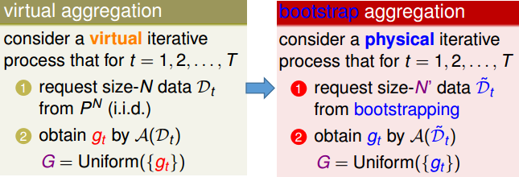

# 模型融合和bagging

## 1. 常见模型融合类型

模型融合：常常是指混合或者结合"假设函数"（为了使模型具有更好的性能）

模型融合的意义：

（左图可以视为combine the predictions conditionally，右图则可以视为mix unifomly）

从上述两种融合情况来看：融合或许能起到① feature transform的作用(左图)  ② regularization的作用(右图)

## 2. 基于均匀混合回归模型解释融合背后的思想

下述情况中需说明：① avg是指针对多个假设函数的平均  ② $E\quad or\quad \mathcal{E}$是指在不同数据集上的数学期望

从上述结果不难看出：一系列假设函数$g_t$的误差平均要大于一系列假设函数平均的误差。

下面根据上述情况的一种特例来进一步说明混合模型的优势：

从上述特例可以很显著的看到均匀混合模型能够减少variance，从而提高模型的稳定性

## 3. 线性混合模型$\iff$线性模型+特征转换

常见混合模型的目标函数：

从上式不难发现：**线性混合模型=线性模型+特征转换(将假设函数视为特征转换)+约束条件**

比如线性融合的线性回归模型等价于线性回归+特征转换

所以对于任意的混合模型可以写成其对应的特征转换模型：

其中$\Phi(x)=(g(x_1),g(x_2),...,g_T(x))$

（虽然上述的any blending可以很强(能够包含任意的条件融合)，但是也会带来overfitting的风险）

## 4. Bagging (Bootstrap Aggregation)

Bagging的定义：

从理想的模型$\Longrightarrow$Bagging模型
