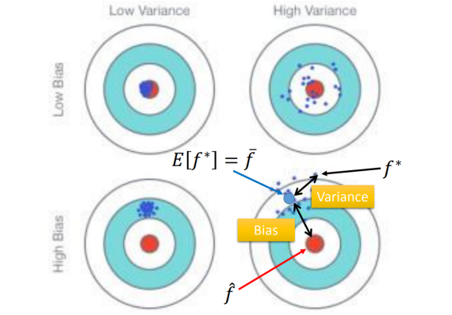
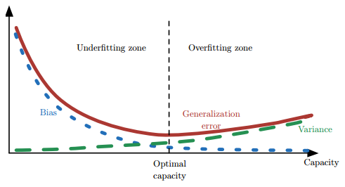

> 下述内容来自：[github](https://github.com/imhuay/Interview_Notes-Chinese/blob/master/%E6%9C%BA%E5%99%A8%E5%AD%A6%E4%B9%A0-%E6%B7%B1%E5%BA%A6%E5%AD%A6%E4%B9%A0-NLP/ML-%E6%9C%BA%E5%99%A8%E5%AD%A6%E4%B9%A0%E5%9F%BA%E7%A1%80.md)

# 机器学习常见概念

## 1. 偏差与方差

> 偏差：bias；  方差：variance

**偏差**与**方差**都是用于衡量一个模型**泛化能力**的指标

> 其中$\hat{f}$代表"真实的解"，$f^\star$代表在某个训练集下的"最优解"，$\bar{f}$代表在多个不同训练集下解的数学期望

偏差：用于描述模型的**拟合能力** --- $\bar{f}$与$\hat{f}$之间的"差距"

方差：用于描述模型的**稳定性** --- $f^\star$之间的"差异性"

**模型复杂度与两者的关系：**

- 模型简单：bias 大，variance 小
- 模型复杂：bias 小，variance 大

### ① 泛化误差

模型的**泛化误差**（Error）可分解为偏差、方差与噪声之和：
$$
Err(x)=Bias^2+Variance+Irreducible\ Error
$$
偏差：$bias^2(x)=(\bar{f}-\hat{f})^2$

> **偏差**度量了学习算法的期望预测与真实结果的偏离程度，即刻画了学习算法本身的拟合能力；

方差：$var(x)=E_D[(f^\star(x;D)-\bar{f})^2]$

> **方差**度量了同样大小的**训练集的变动**所导致的学习性能的变化，即刻画了数据扰动所造成的影响（模型的稳定性）；

噪声：$\varepsilon^2=E_D[(y_D-y)^2]$

> **噪声**则表达了在当前任务上任何学习算法所能达到的期望泛化误差的下界，即刻画了学习问题本身的难度。

### ② 偏差与方差的权衡

- 偏差与方差是有冲突的，需要折衷（trade-off）
- 给定学习任务，
  - 当训练不足时，模型的**拟合能力不够**（数据的扰动不足以使模型产生显著的变化），此时**偏差**主导模型的泛化误差；
  - 随着训练的进行，模型的**拟合能力增强**（模型能够学习数据发生的扰动），此时**方差**逐渐主导模型的泛化误差；
  - 当训练充足后，模型的**拟合能力过强**（数据的轻微扰动都会导致模型产生显著的变化），此时即发生**过拟合**（训练数据自身的、非全局的特征也被模型学习了）
- 偏差和方差的关系和**模型容量**、**欠拟合**和**过拟合**的概念紧密相联
  
  - 当模型的容量增大（x 轴）时， 偏差（用点表示）随之减小，而方差（虚线）随之增大
  - 沿着 x 轴存在**最佳容量**，**小于最佳容量会呈现欠拟合**，**大于最佳容量会导致过拟合**。

> Underfitting：大的 bias，小的 variance
>
> - 特点：模型在训练集上的效果不好
> - 解决方法：重新设计模型（加入更多特征，采用更复杂的模型）
>
> Overfitting：小的 bias，大的 variance
>
> - 特点：训练集上效果好，但是在测试集上效果不好
> - 解决方法：① 更多数据，比如人工合成数据等  ② Regularization

## 2. 生成模型与判别模型

- 监督学习的任务是学习一个模型，对给定的输入预测相应的输出

- 这个模型的一般形式为一个**决策函数**或一个**条件概率分布**（后验概率）：
  $$
  Y=f(X)\quad or\quad P(Y|X)
  $$

  - **决策函数**：输入 X 返回 Y；其中 Y 与一个**阈值**比较，然后根据比较结果判定 X 的类别
  - **条件概率分布**：输入 X 返回 **X 属于每个类别的概率**；将其中概率最大的作为 X 所属的类别

- 监督学习模型可分为**生成模型**与**判别模型**

  - 判别模型直接学习决策函数或者条件概率分布

    - 直观来说，**判别模型**学习的是类别之间的最优分隔面，反映的是不同类数据之间的差异

  - **生成模型**学习的是联合概率分布`P(X,Y)`，然后根据条件概率公式计算 `P(Y|X)`
    $$
    P(Y|X) = \frac{P(X,Y)}{P(X)}
    $$

**两者之间的联系**

- 由生成模型可以得到判别模型，但由判别模型得不到生成模型。
- 当存在“**隐变量**”时，只能使用**生成模型**

> 隐变量：当我们找不到引起某一现象的原因时，就把这个在起作用，但无法确定的因素，叫“隐变量”

**优缺点**

- **判别模型**
  - 优点
    - 直接面对预测，往往学习的准确率更高
    - 由于直接学习 `P(Y|X)` 或 `f(X)`，可以对数据进行各种程度的抽象，定义特征并使用特征，以简化学习过程
  - 缺点
    - 不能反映训练数据本身的特性
    - ...
- **生成模型**
  - 优点
    - 可以还原出联合概率分布 `P(X,Y)`，判别方法不能
    - 学习收敛速度更快——即当样本容量增加时，学到的模型可以更快地收敛到真实模型
    - 当存在“隐变量”时，只能使用生成模型
  - 缺点
    - 学习和计算过程比较复杂

**常见模型**

- 判别模型
  - K 近邻、感知机（神经网络）、决策树、逻辑斯蒂回归、**最大熵模型**、SVM、提升方法、**条件随机场**
- 生成模型
  - 朴素贝叶斯、隐马尔可夫模型、混合高斯模型、贝叶斯网络、马尔可夫随机场

## 3. 先验概率与后验概率

**条件概率**（似然概率）

- 一个事件发生后另一个事件发生的概率。
- 一般的形式为 `P(X|Y)`，表示 y 发生的条件下 x 发生的概率。
- 有时为了区分一般意义上的**条件概率**，也称**似然概率**

**先验概率**：指根据以往经验和分析。在实验或采样前就可以得到的概率

- 事件发生前的预判概率
- 可以是基于历史数据的统计，可以由背景常识得出，也可以是人的主观观点给出。
- 一般都是**单独事件**发生的概率，如 `P(A)`、`P(B)`。

**后验概率**：指某件事已经发生，想要计算这件事发生的原因是由某个因素引起的概率

- 基于先验概率求得的**反向条件概率**，形式上与条件概率相同（若 `P(X|Y)` 为正向，则 `P(Y|X)` 为反向）

**贝叶斯公式**：
$$
P(Y|X)=\frac{P(X|Y)\times P(Y)}{P(X)}
$$

> 其中的$P(Y)$可以理解为先验概率，$P(X|Y)$理解为条件概率，$P(X)$理解为归一化证据因子，$P(Y|X)$理解为后验概率

