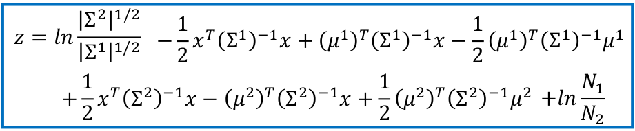
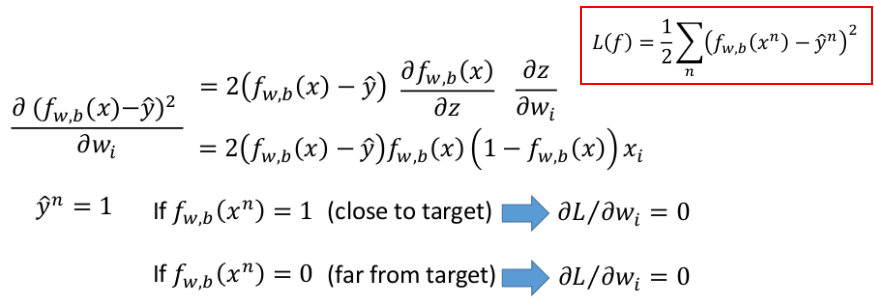

# 分类

## 1. 分类概述

首先给出分类问题的"定义"：

**可以采用的方法**：（以二分类为例）

① 利用Regression来做classification

- 具体实现：将类别1用数值1表示，类别2用数值-1来表示，利用$y=w^Tx+b$进行拟合。离1近的属于类别1，离-1近的属于类别2

- 存在的问题：

  1. 会惩罚"过于"正确的项（如100与1的距离在损失函数中所占比重很大）
     

     > 本身y的值是第三维上面，上述直线仅仅是y=0的情况

  2. 多分类问题会导致"临近值"（即用相近数字代表的类别会更密切一点）间会存在某种联系

② "更理想的替换方法"

> 如Perceptron和SVM

③ 概率模型

给定一个$x$，我们判断它属于某一类的概率：

> 其中：$P(x)=P(x|C_1)P(C_1)+P(x|C_2)P(C_2)$ --- 称为生成模型

## 2. 概率生成模型

针对上述③，我们不妨一步步拆解来看：

- $P(C_1)=N_1/(N_1+N_2)$：直接通过样本来近似
- $P(C_2)=N_2/(N_1+N_2)$：同上

下面我们来求解$P(x|C_i)$

### ① 假设1：每个类别中样本点都满足高斯分布

以单类先进行分析

1. 那么每个类别的数据都可以表示为：

2. 利用极大似然法来求解高斯分布中的$\mu$和$\Sigma$（即取出所有属于该类的样本数据）：
   

   > 假设有上述79笔数据属于该类

3. 其实2相当于求解出了$P(x|C_i)$，所以我们已经可以求解$P(C_1|x)$了：
   

   > 上述的具体数字是具体的一个实例，你可以不用太在意

这样我们其实已经完成了概率模型的分类问题

但我们不妨来看下参数量：(二分类情况)

- 参数量=$2\times n+2\times n\times n=2n+2n^2$ --- 其实参数量还是蛮多的，比较容易overfitting。

所有我们进一步约束高斯模型，下面进入假设2

### ② 假设2：再假设1的基础上，加上$\Sigma^1=\Sigma^2$（即variance一样）

此时同样采用极大似然估计我们可以有下述结论：

> 此处的$\mu^1=\frac{1}{N_1}\sum_{n=1}^{N_1}x^n$，$\mu^2=\frac{1}{N_2}\sum_{n=1}^{N_2}x^n$

此时的参数量其实就只有：$2\times n+n\times n$

> **当然，也可以为$P(x|C_i)$建立您认为更合理的假设**（这个本身就是开放性的问题）

### ③ 概率模型$\to$logistic回归

我们对概率模型稍微"整理"和变量替换一下，就有下述结果：

step1：下面我们基于上述①这个假设来看看此时的$P(C_1|x)$可以变成什么。主要其实就是求z：

将$P(x|C_1)$和$P(x|C_2)$代入z的左边可解除下述情况：

> 具体的推导流程你就代入，耐心地一步步进行即可

step2：看看将假设②代入上式又能变成什么呢：

所以最终我们有：
$$
P(C_1|x)=\sigma(wx+b)
$$

> 我们是通过估计$N_1,N_2,\mu^1,\mu^2,\Sigma$来计算w和b的；所以自然而然的在想能不能直接估计w和b呢

## 3. 逻辑斯蒂回归

### ① 逻辑斯蒂回归的"三步法"

step1：Function Set

step2：Goodness of a Function

其中的C的定义：

> 关于这部分推导如下（基于MLE）：
>
> 

step3：Find the best function

### ② 各种对比

#### Logistic为什么不用平方损失

我们来看看如果采用平方损失的梯度情况：

> 我们可以发现当"很错"时，即far from target的情况下，梯度也非常小，这明显不利于梯度下降法进行参数更新

#### Discriminatve v.s. Generative

> 虽然两者模型一致，但最后得到的函数其实是不一样的 --- 因为求解的方式不同

- 在很多情况下，判别式模型结果优于生成式模型
- 生成模型的优点：（核心其实就是好的先验会有好的结果）
  - 如果假设的分布合理，则所需的数据量更少
  - 如果假设的分布合理，鲁棒性更好
  - 先验(Priors)和类别相关的概率可以通过不同的数据源来进行估计

## 4. 多类别问题

> 关于softmax如下所示：
>
> 

