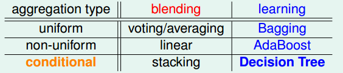
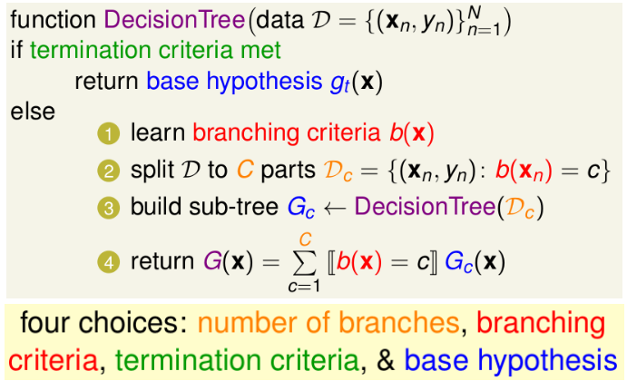
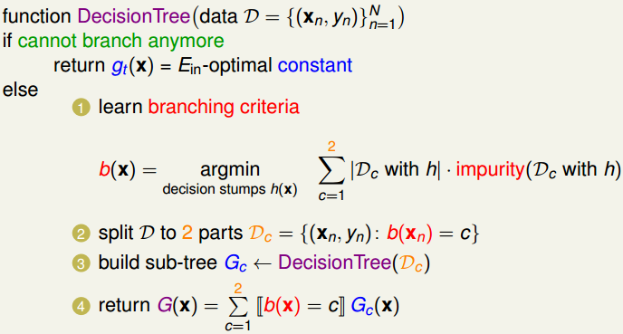
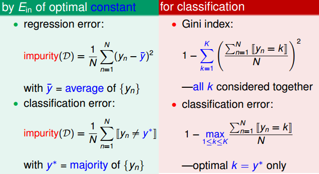
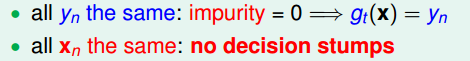
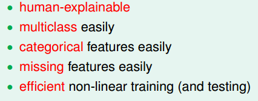

# Decision Tree

## 1. 三种不同类型的集成模型

常见的三种基本集成模型如下表所示（其中①blending代表融合的方式---可以理解为在获得$g_t$后采用的融合策略 ②learning代表具体的学习算法---可以理解为在学习的过程中就将融合的策略加入$g_t$）

后续大部分集成算法都是基于这些集成算法进一步“融合或改进”

## 2. 决策树模型基本框架

（不同的四种条件构成不同的决策树算法）

## 3. CART算法（决策树模型的一种例子）

CART的算法：

下面让我来看看在CART中4个条件是如何选择的：

① 分支数目：选为2

② 分支"划分"条件：寻找使得"纯度函数"最小的$h(x)$(决策树桩)，通常采用下述纯度函数

（友情提示：“纯度函数”(impurity函数)的选择：推荐回归问题中采用regression error，分类问题中选用Gini index）

③ 终止条件：有两者情况，一种是剩下的全部都是相同的标签情况，另一种是剩下的x全相同了

④ 基础的假设函数：采用决策树桩

（合起来用一句话概括CART：fully-grown tree with constant leaves that come from bi-branching by purifying）

### CART存在的问题及改进

① 过拟合问题：完全生长的树容易导致过拟合（$E_{in}=0$）
加入正则项，该正则项可以为限制**叶子结点**的数目，从而使树“生长”到一定程度就停止了

② 特征缺失问题：比如需预测的数据中某个特征$x_i$缺失
在进行划分的过程中，如果遇到最优划分特征为“$x_i$”，则采用“次优或其他”的特征(且该数据包含的特征)来替代该特征的划分。但是这样付出的代价就是要“保留”其他特征“拿来替换”特征的划分标准等

CART树的优点：

