# GBDT（Gradient Boosted Decision Tree）

## 1. AdaBoost-DTree

类似随机森林的方法，将adaboost运用到decision tree上面可以得到AdaBoost-DTree上，有下述结果：

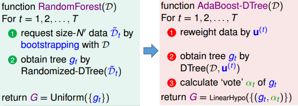

上述“直接延伸”存在的问题：
① 破坏了DTree，需要重新构造新的决策树算法
**解决方法**：将权值通过“bagging”来体现，即bagging取样时，并不是直接采用等概率随机方法，而是根据$samling\propto u^{(t)}$来取样，从而也能起到$E_{in}^{u}(h)=\frac{1}{N}\sum u_n\cdot err(y_n,h(x_n))$的效果
② 完全生长树存在误差为0的问题：

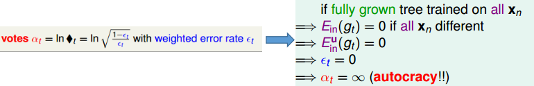

**解决方法**：通过对树进行剪枝，比如限制树的高度，限制叶子结点的数目等等。

## 2. 以优化的观点来看AdaBoost(不感兴趣可以忽略)

AdaBoost更新$u_n^{(t+1)}$时采用下述的策略：

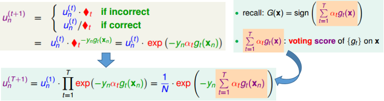

（上面式子的推导需要回顾AdaBoost的内容：为方便，给出表达式：$\epsilon_t=(\sum_{n=1}^Nu_n^{(t)}[y_n\ne g_t(x_n)]/(\sum_{n=1}^N u_n^{(t)}$，$\blacklozenge_t=\sqrt{(1-\epsilon_t)/\epsilon_t}$，$\alpha_t=ln(\blacklozenge_t)$）

令$s_n=\sum_{t=1}^T\alpha_tg_t(x_n)$（称作voting score），站在SVM的角度可见，当$y_ns_n$越大，代表离分离超平面越远，如果全部的数据均能使得其随着$T$增大，$y_ns_n$增大，则说明这个超平面“越来越好，鲁棒性更强”（请站在最终结果的角度您可能更好理解）：

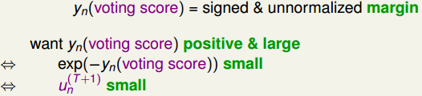

因此，AdaBoost问题的每次更新可以理解为不断减少$\sum_{n=1}^N u_n^{(t)}$，因此可以视为下述优化问题：

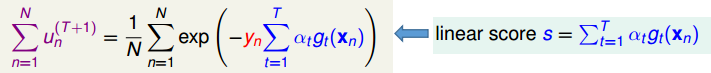

为了与常见的损失函数联系起来，建立下述对应关系：
$$
E(w_t)=\frac{1}{N}\sum_{n=1}^N exp(-y_nw_t)\quad w_t=\sum_{k=1}^{t-1}\alpha_kg_k(x_n)\\
等价于err=exp(-ys)的损失函数
$$
从而通过“一阶泰勒展开”来推导梯度下降法：
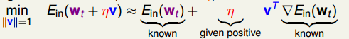
从而可以推导出下式（理清$w_t​$具体表示的是什么），其中$v=h(x)​$：
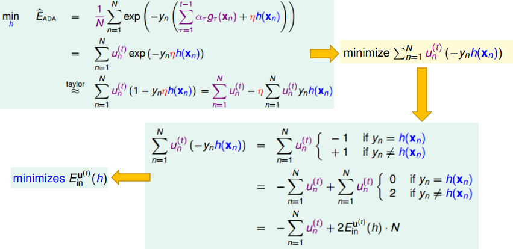
上式推导可见，通过梯度下降法寻找的最优$h=v$等价于通过AdaBoost算法寻找$E_{in}^{u(t)}(h)$最佳的$h$。因此可见，AdaBoost算法背后的原理也就是通过梯度下降法寻找最优的$h$

当求解得最佳的$g=h$，下一步就是求解$\eta$：

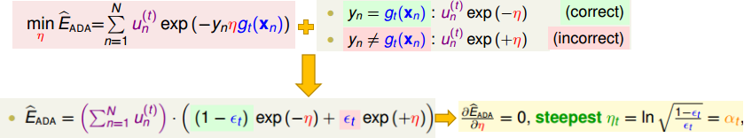

求解结果也等价于AdaBoost中采用的$\alpha_t$。

从而可见，AdaBoost可以视为GradientBoost的一种情况，且GradientBoost具有更好的“可拓展性”，可以更改误差衡量函数$err$便可获得不同的GradientBoost算法：

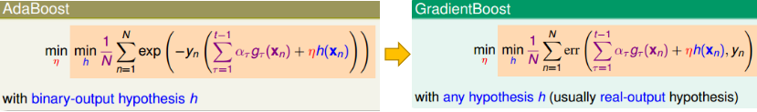

GradientBoost算法通常的解法：
① 先将$\eta$视为常量，求最佳的$h=g$
② 将最佳的$g$代入，求最佳的$\eta$

## 3. 基于平方损失的GradientBoost

对应的GradientBoost基本形式：

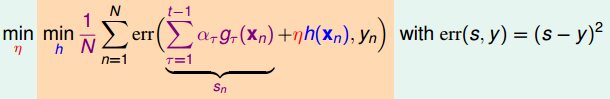

步骤①： 寻找最佳$h$：

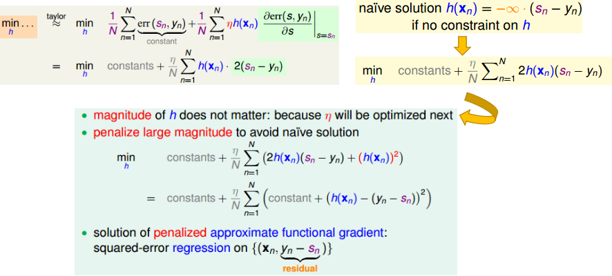

步骤②： 寻找最佳$\eta$：

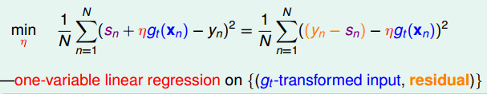

步骤③： 结合全部的情况，并结合决策树，获得最终的GBDT算法

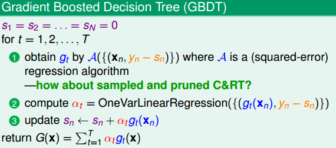

