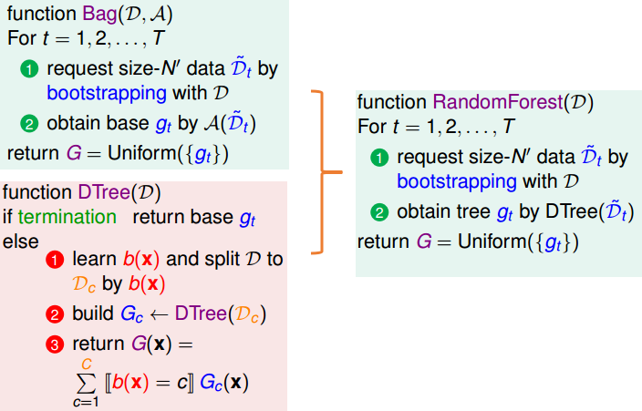
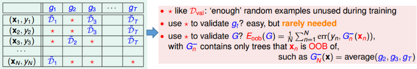
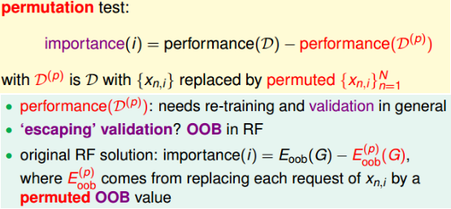

# 随机森林

## 1. 随机森林算法框架

随机森林=bagging+fully-grown CART：结合了bagging降低variance的特点以及CART具有较大variance的特点。（即用bagging来降低CART overfitting的风险）

## 2. 增加"多样性"的方法

增加随机森林"多样性"的方法（增加了决策树的多样性）--- 这也是随机森林"随机"的体现：
① 通过“bagging”使得每次数据集不一样，从而使得每次决策树基于的样本不同。增加了决策树的多样性
② 每次$b(x)$过程中选用$d^\prime$个特征，而不是$d$个特征（$d^\prime \ll d$），从而能够获得更多不同的决策树 

## 3. 随机森林的小技巧

① 随机森林的自验证（OOB validation）
通过bagging每次会有一部分数据并未被取到，而该部分可以被用作验证集

需要注意的是，其中$G_n^{-}(x_n)$代表在bagging时未取到$x_n$的全部的决策树的平均，而不是全部决策树的平均

② 特征选择技巧
可以采用的策略有

- 移除冗余特征(如年龄和生日)和不相关特征

- 给不同特征赋予不同的重要性，在随机森林中可以通过下述策略来衡量特征重要性（替换后错误率改变多少来衡量）：
  

③ 随机森林可能存在的问题
当全部的“随机过程”显得非常“随机”时，会带来不稳定性，从而可能需要非常多的决策树融合才能达到较好的效果