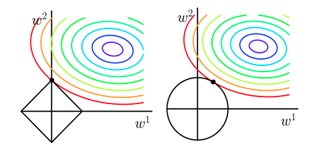

> 下述内容来自：[github](https://github.com/imhuay/Interview_Notes-Chinese/blob/master/%E6%9C%BA%E5%99%A8%E5%AD%A6%E4%B9%A0-%E6%B7%B1%E5%BA%A6%E5%AD%A6%E4%B9%A0-NLP/DL-%E6%B7%B1%E5%BA%A6%E5%AD%A6%E4%B9%A0%E5%9F%BA%E7%A1%80.md)

# 正则化

## L1/L2范数正则化

### ① L1/L2 范数的作用、异同

**相同点**

- 限制模型的学习能力——通过限制参数的规模，使模型偏好于**权值较小**的目标函数，防止过拟合。

**不同点**

- **L1 正则化**可以产生更**稀疏**的权值矩阵，可以用于特征选择，同时一定程度上防止过拟合；**L2 正则化**主要用于防止模型过拟合
- **L1 正则化**适用于特征之间有关联的情况（相当于剔除掉一些重复特征）；**L2 正则化**适用于特征之间没有关联的情况。

> L2正则对异常值更敏感 --- 主要由于二次方的缘故
>
> - L2 --- Ridge
> - L1 --- Lasso

### ② 为什么 L1 和 L2 正则化可以防止过拟合？

- L1 & L2 正则化会使模型偏好于更小的权值。
- 更小的权值意味着**更低的模型复杂度**（一种简单的理解：x的变化不会导致y的剧烈变化）；添加 L1 & L2 正则化相当于为模型添加了某种**先验**，限制了参数的分布，从而降低了模型的复杂度。
- 模型的复杂度降低，意味着模型对于噪声与异常点的抗干扰性的能力增强，从而提高模型的泛化能力。——直观来说，就是对训练数据的拟合刚刚好，不会过分拟合训练数据（比如异常点，噪声）——**奥卡姆剃刀原理**

### ③ 为什么 L1 正则化可以产生稀疏权值，而 L2 不会？

- 对目标函数添加范数正则化，训练时相当于在范数的约束下求目标函数 `J` 的最小值
- 带有**L1 范数**（左）和**L2 范数**（右）约束的二维图示
  
  - 图中 `J` 与 `L1` 首次相交的点即是最优解。`L1` 在和每个坐标轴相交的地方都会有“**顶点**”出现，多维的情况下，这些顶点会更多；在顶点的位置就会产生稀疏的解。而 `J` 与这些“顶点”相交的机会远大于其他点，因此 `L1` 正则化会产生稀疏的解。
  - `L2` 不会产生“**顶点**”，因此 `J` 与 `L2` 相交的点具有稀疏性的概率就会变得非常小。

### ④ L1和L2结合

[Elastic Net](http://web.stanford.edu/~hastie/TALKS/enet_talk.pdf)：elastic net 的提出是为了可以解决feature之间的高相关性问题，单纯Lasso一般会在一个高相关性 的特征group里面选取一个显著特征

> 说明：这部分个人没怎么看

