> 这部分内容主要来自个人的另一个笔记：[MLF-MLT](https://github.com/AceCoooool/MLF-MLT)，在这里会写的更详细一点

# SVM系列

## 1. 线性SVM（针对二分类情况）

### 1.1 为什么要用SVM

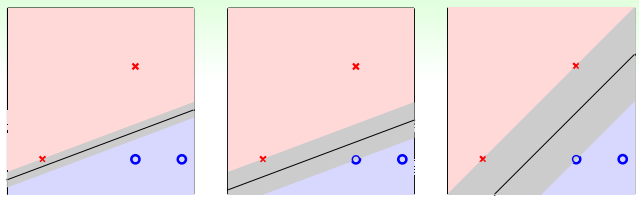

能够使得模型具有更强的鲁棒性（因为"margin"越大，由于噪声干扰造成的误分类就会越少）

### 1.2 模型推导

① 首先给出模型"大margin"的数学定义（这条应该比较好理解）

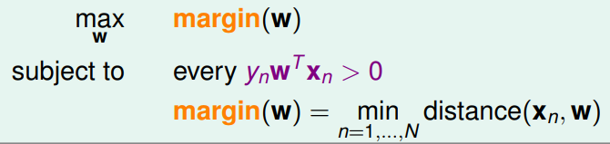

② 来看看distance是如何计算的

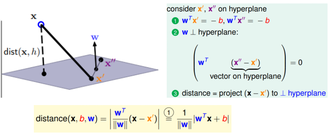

其实就是距离的定义啦（相信你们是秒懂的）

③ 将distance的定义代入①中就可以得到：

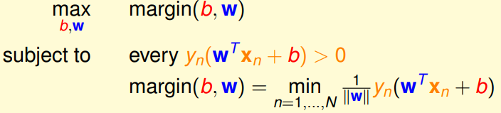

由于最终的$w,b$需要将全部数据都分对(硬分类)，所以$y_n(w^Tx_n+b)=|w^Tx+b|$（$y_n=\{+1,-1\}$）成立

④ 让我们对③式再改造一下吧（后续的改造您都可以认为是为了方便求解）

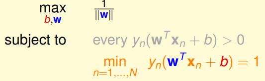

解释：由于我们将$w,b$同倍数进行缩放，并不影响最后的结果（这就使得我们能够"随心所欲"地控制$y_n(w^Tx_n+b)$的最小值），所以我们就去寻找那个使得上式成立的$w,b$就好啦。（又因为最小的$y_n(w^Tx+b)=1$，所以其他全部的数据自然会大于0）

⑤ 对式子④的情况约束条件变下（但是解是一样的，本质就是我放宽条件，但是最优解还是那个）

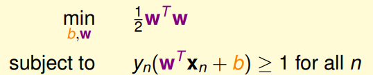

> 到此为止，一切推导皆已搞定。

### 1.3 如何求解

线性SVM对应的表达式属于二次规划的问题，因此可以直接采用现成的求解方式求解：

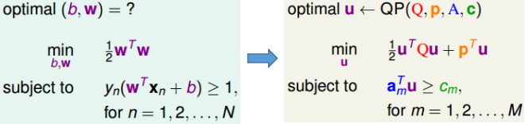

具体的算法流程如下所示：

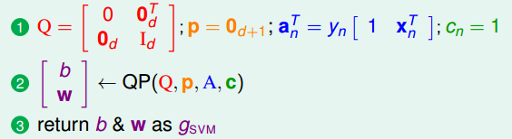

### 1.4 SVM背后的依据&优势

解释①：寻找最大边界超平面可以视为加入正则化过程的一种特殊情况

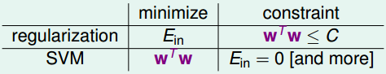

解释②：使得$d_{vc}$依赖于数据，从而有效降低了$d_{vc}$，因此可以避免overfitting

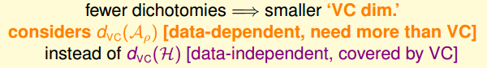

**优势**：由于SVM自带降低$d_{vc}$的“属性”，因此自带削弱“过拟合”的“光环”，将其和特征转换组合起来，既能获得非常复杂的分离超平面，又能避免过拟合。

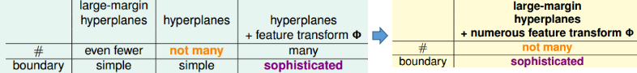

## 2. 对偶SVM

### 2.1 为什么要引入对偶SVM

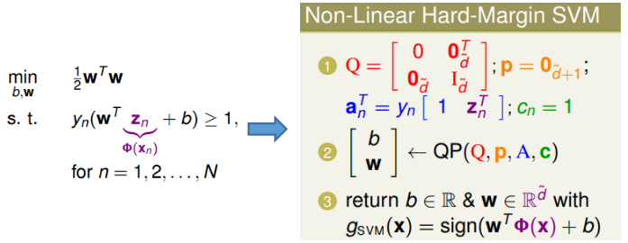

主要在于"非线性情况"下参数数目非常多（此处我们假设$\hat{d}>>N$），这就给求解带来巨大的挑战。

（因此我们希望获得N个变量，N+1个约束条件的等价Quadratic Programming形式：数学的魅力来了）

### 2.2 对偶SVM推导

① 将原问题转为拉格然日函数形式：

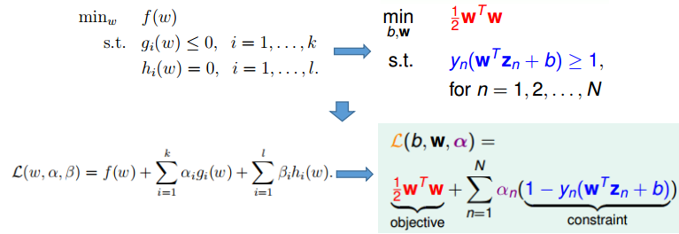

> 关于拉格朗日乘子法的理解可见：[拉格朗日乘子理解](https://www.zhihu.com/question/38586401)，[拉格朗日乘数](https://zh.wikipedia.org/wiki/拉格朗日乘数)
>
> 下面给出一种比较简单的解释：(即"破坏约束"条件的结果比"不破坏约束"条件的情况要差)
>
> 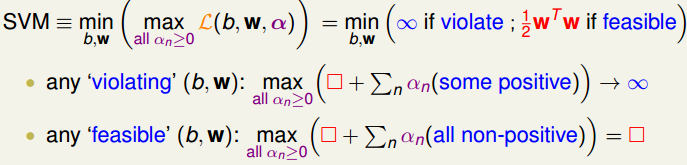

② minmax到maxmin的转变

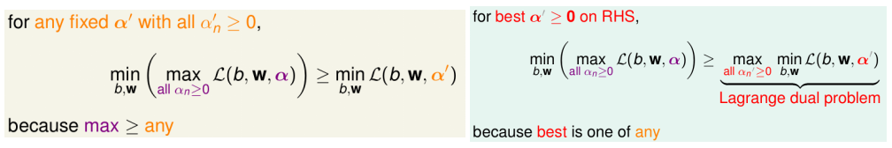

（核心思想就是：最大比任何都大+最好的是全部中的一种）

> 上述表达式为"弱对偶"条件(`>=`)，而强对偶情况是指`minmax=maxmin`

进一步给出强对偶的条件（针对QP问题）：

- convex primal
- feasible primal（true if $\Phi$-separable）
- linear constaints

（显然对于我们的问题都是满足的---因此后续的求解都直接求Lagrange dual形式吧～☺）

③ 朗格朗日对偶形式的求解

> 一般的步骤：
>
> 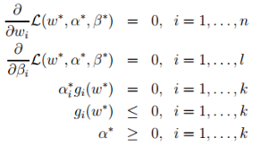
>
> 1. 对Lagrange dual中的min项对应“下标参数”求导，代入$\mathcal{L}$进行一定的“约简” 
> 2. 结合原始条件+对偶问题中隐含的条件$\alpha^\star_ig_i(w^\star)=0$ 
> 3. 将全部结果代入$\mathcal{L}$，将结果化为只包含max项对应“下标参数”的情况

下面让我们看看在SVM的推导中是如何做的：

1. 对b求导，"约简"掉b（对应步骤1）
   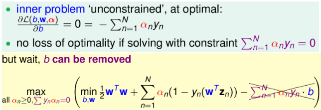
2. 对$w_i$求导（对应步骤1,2,3）
   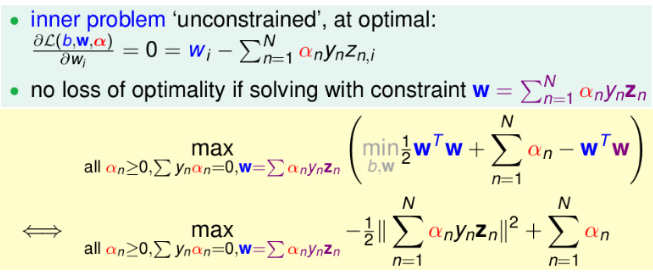

> 这里我们可以发现，原始形式里面的条件已经转变了（但是等价的---称作KKT条件：您可以理解为到时求得$\alpha$之后，如何求$b$和$w$）
>
> 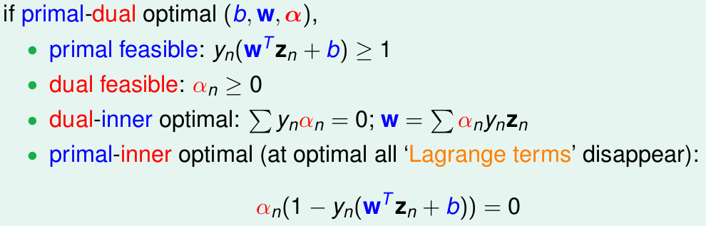

3. 写成标准的对偶形式：
   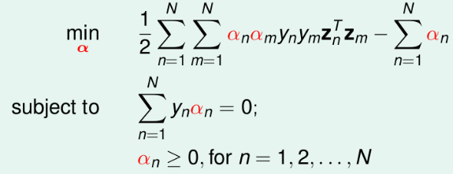

（变成N个变量了(n个$\alpha_k$)，和N+1个约束条件了！开不开心，激不激动！）

4. 求解获得了$\alpha_n$，如何进一步求解$w$和$b$
   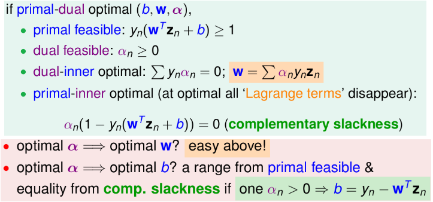

### 2.3 对偶SVM的含义

① SVM的supported vector

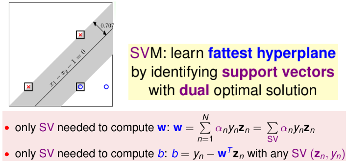

(其中的w由做为SV的"数据"所求得)

② SVM vs PLA

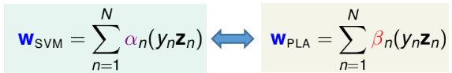

（可以发现svm的参数$\alpha$通过对偶求解，而pla中的$\beta$是根据误分类的情况）

### 2.4 原始vs对偶总结

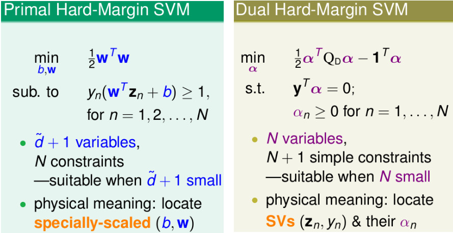

