> 这部分内容主要来自个人的另一个笔记：[MLF-MLT](https://github.com/AceCoooool/MLF-MLT)，在这里会写的更详细一点

# SVM系列(2)

## 2. 核函数SVM

### 2.1 为什么要引入核函数

核函数本质上是将两个变量特征转换的乘积用两个变了乘积的形式来体现，从而有效减少计算复杂度。一个简单的对应关系实例如二次多项式核函数：

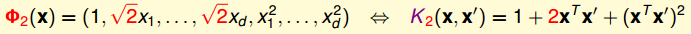

### 2.2 核函数算法

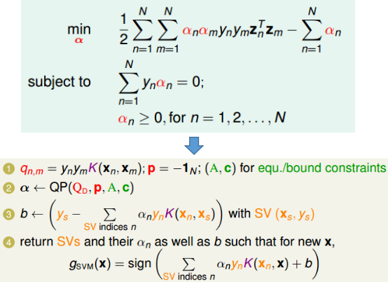

### 2.3 常见核函数

① 线性核函数
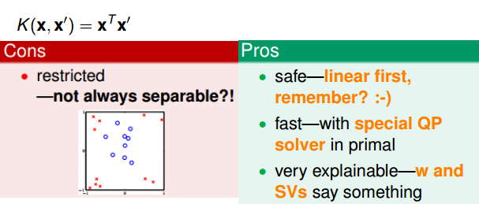
② 多项式核
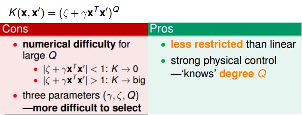
③ 高斯核
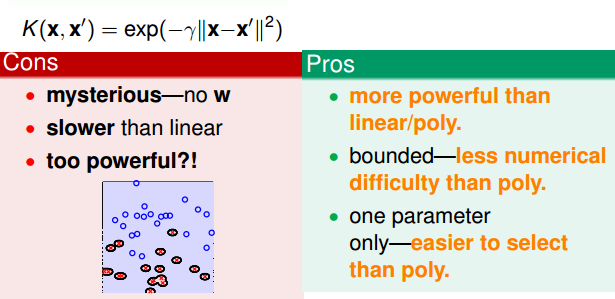

一个函数能否作为核函数的判别标准比较简单，满足Mercer's condition：
① 对称性
② 半正定性

**通过已有核函数构造新的核函数的方法**：

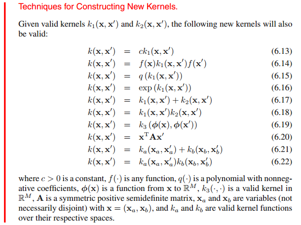

## 3. 柔性边界SVM

### 3.1 为什么要引入柔性边界

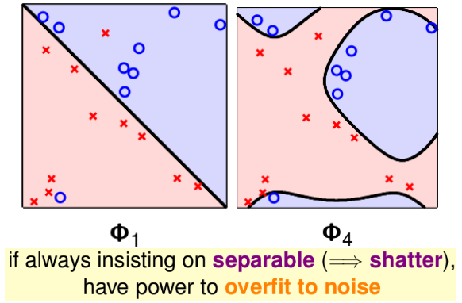

### 3.2 柔性边界SVM的形式

加入惩罚因子后的基本形式和其对应的拉格朗日函数：

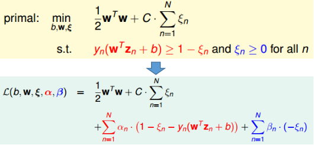

（采用这种形式的柔性惩罚主要是为了数学上方便求解---倒不是说只能采用这种方式）

利用强对偶情况的求解方式进行求解（与最大边界情况完全类似），可以获得其对偶形式如下：

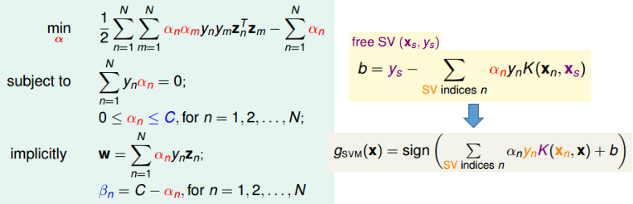

①上述对偶形式与hard-margin形式的SVM除了$\alpha_n$的边界发生了变化，其他全部一样！
②上述情况中的free SV是指$0\lt\alpha_n\lt C$对应的数据项。
③ $\alpha_n=C$的情况代表“越界”的数据点（即被惩罚的数据）

## 4. 基于核函数的Logistic回归

### 4.1 柔性SVM与含正则项模型

根据柔性SVM的定义，可以获得其等价的无约束情况：
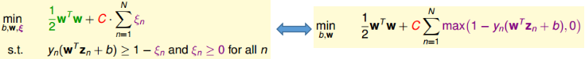

> 主要由于：
>
> 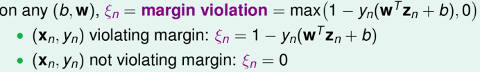

从无约束SVM的表达式可见，其非常“相似于”加入了$L_2$正则项的模型：
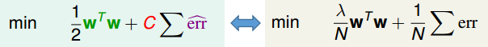
上述情况可见柔性SVM本质就是含有一个特殊$err$，以及利用另一个参数$C$替代$\lambda$以及选用更小的$w$的含正则项的模型。

**结合上篇文章中指出的，不管是柔性SVM还是hard-margin SVM均可以视为含正则项的模型**：
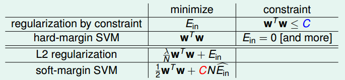
上述表格中包含一定的对应关系：
① 大的边界$\iff$更少可供选择的超平面$\iff$$L_2$正则化里将$w$限制的更小
② 柔性边界$\iff$特殊的损失函数$\hat{err}$
③ 大的“越界惩罚”$C$$\iff$更小的$\lambda\iff$“更弱”的正则化（其实就是更大的假设函数集 --- 你可以这么想，C越大，越容易overfitting哦）

将SVM看做含正则项的模型，这样更有助于理解和扩展

### 4.2 柔性SVM vs Logistic回归

柔性SVM的错误度量标准可以视为一种特殊的错误度量标准，将其与Logistic回归的错误度量标准进行比较：
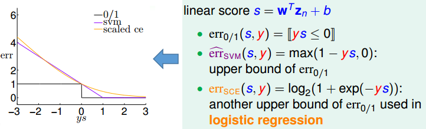
可以看出，当$ys\to-\infty or+\infty$时，$err_{SVM}\approx err_{SCE}$，所以$SVM\approx L2$正则化的Logistic回归

（这也是为什么SVM对应hingle loss的原理哦～）

### 4.3 SVM用于柔性二元分类

将SVM与Logistic回归结合起来，可以用于柔性二元分类（即以概率的形式给出结果），其具体的算法和优化目标如下所示：
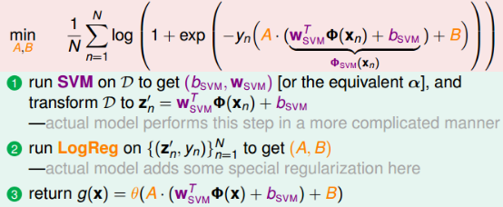
其中步骤①就是常规的SVM解法，步骤②可以采用梯度下降法来获得最优的$(A,B)$

### 4.4 表示理论（什么情况适用核函数）

首先给出表示理论的说明：
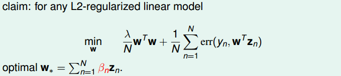
给出解释：
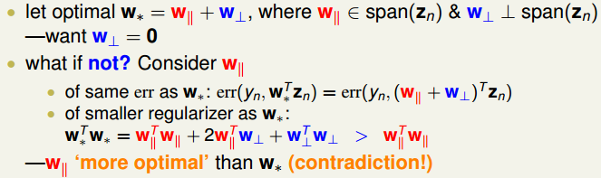
从而可见，对于任意$L_2$正则化的线性模型均可以采用核函数的方式！！！

### 4.5 基于核函数的logistic回归

将$w$最优解$w^\star=\sum_{n=1}^N\beta_nz_n$代入Logistic回归的目标函数，可以将其转换为核函数形式，且将求最优$w$的问题转变为求最优$\beta$的问题：
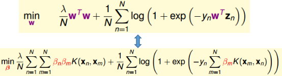
从上述可见，目标函数变得非常类似与SVM。但需要注意的是，该目标函数解得的$\beta$并不类似于SVM求得的$\alpha$具有很强的稀疏性。对于核函数的Logistic回归所求得的$\beta$大部分都是非零的。
可以如此理解，Logistic回归中是将所有数据均考虑进来，并没有支撑向量这个概念。不管转变与否，每个数据在Logtistic中至始至终都是被使用着。

## 5. SVR(Support Vector Regression)

### 5.1 基于核函数的Ridge回归问题(LLSVM)

根据上面的内容可知，根据表示规则，Ridge回归问题可以转变为等价的含核函数问题：将$w^\star=\sum_{n=1}^N\beta_nz_n$代入原目标函数即可：
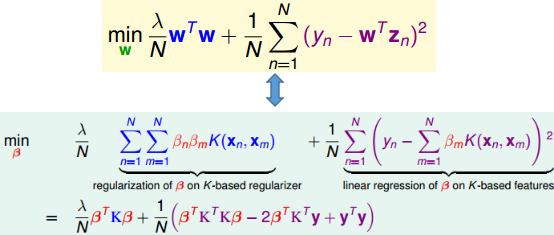
从而问题转变为求最优的$\beta$使得新的目标函数最小，对上式进行求导可得：
$$
\nabla E=\frac{2}{N}(\lambda K^TI\beta+K^TK\beta-K^TY)=\frac{2}{N}K^T((\lambda I+K)\beta-Y)\\
\nabla E=0\to\beta=(\lambda I+K)^{-1}Y
$$

从上式也不难发现，大部分$\beta$为非0，因此也为非稀疏的。

### 5.2 Tube Regression

类似于“柔性”SVM，tube回归在原有线性回归模型中增加一定的“容忍度”，在距离小于一定范围内，认为没有误差，而大于该范围，则产生误差（从而使得$\beta$为稀疏的）。定义损失标准函数如下：
$$
err(y,s)=max(0,|s-y|-\epsilon)
$$
上述中容忍度为$\epsilon$。

从而带有$L_2$正则项的tube回归问题的目标函数为，以及为了更加与SVM形式对应，将$\lambda$替换为$C$：
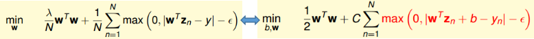

### 5.3 Tube Regression$\to$SVR

类比于柔性SVM其含约束情况，可以将上述tube回归问题转化为含约束的情况：
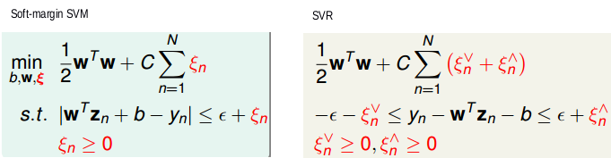
此时，后续的对偶化求解方式与SVM完全一样，可以自行推导，可以获得其等价的对偶形式，其中$\alpha^{\land}_n$是指$y_n-w^Tz_n-b\le\epsilon+\xi_n^{\land}$条件转化的拉格朗日乘子。$\alpha^{\lor}_n$是指$y_n-w^Tz_n-b\ge\epsilon+\xi_n^{\lor}$条件转化的拉格朗日乘子：
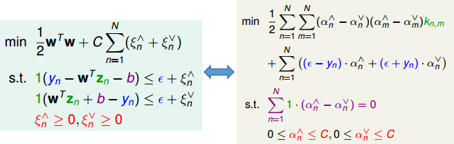
此外，上述的$\beta$是稀疏的，且稀疏项对应关系如下所示：
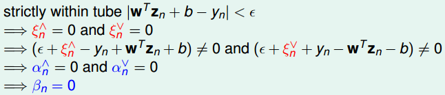

## 6 线性函数/核函数大集结

目前所有用到的线性模型以及其对应采用的核函数模型如下所示：
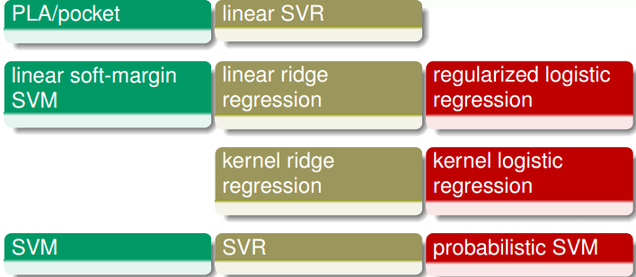
需要说明几点：
① 第四行在LIBSVM中非常受欢迎
② 第三行很少使用，因为其对应的$\beta$为非稀疏的
③ 第二行在LIBLINEAR中非常受欢迎
④ 第一行很少很少使用，因为一般表现比较差