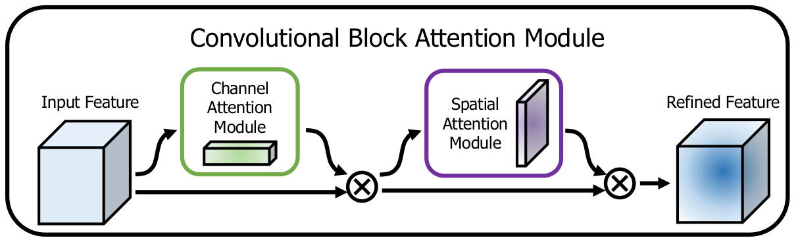
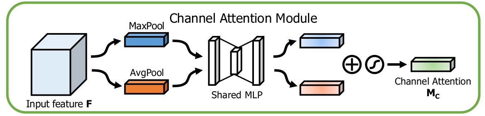
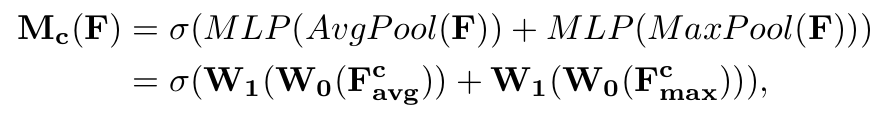
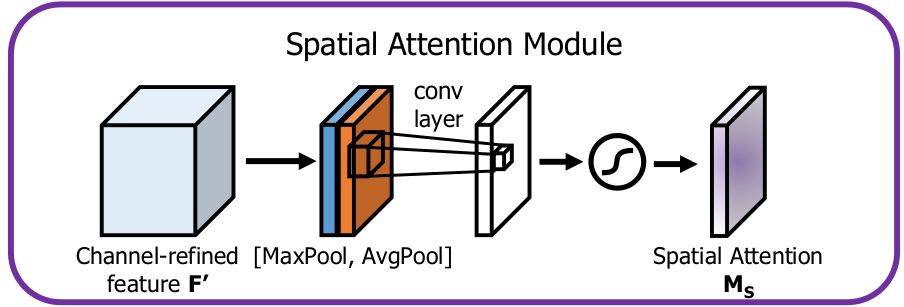
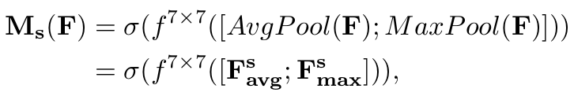
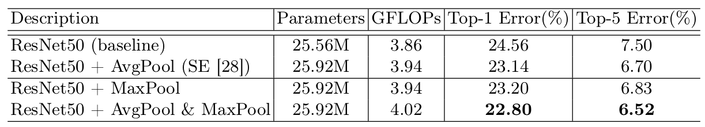
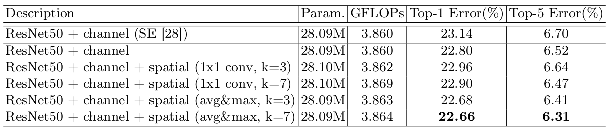
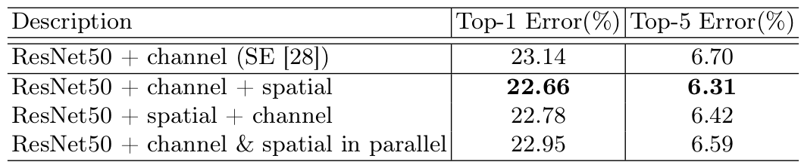
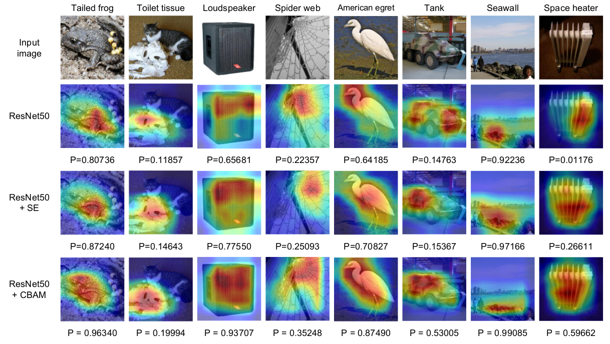

> 论文地址：[CBAM: Convolutional Block Attention Module](https://arxiv.org/abs/1807.06521)

# CBAM: Convolutional Block Attention Module

> 摘要：作者针对卷积神经网络提出了一种简单却高效的注意力机制模块：Convolutional Block Attention Module（CBAM）。针对给定的中间特征，该模块能够在两个维度上面（通道维度和空间维度）"推导"出注意力权重图，而将这些注意力权重乘到原本的特征上面，能够对特征进行"针对性地增强"。由于CBAM是一个轻量级但通用的模块，因此他可以集成到任意的CNN架构中去（只需付出少量的计算代价，且依旧可以端到端的训练）。作者在分类（ImageNet-1K），检测（MS COCO和VOC2007）上均验证了该模块的有效性。

## 1. 结构和原理

CBAM并不是直接计算3d的attention map，而是学习两个维度的attention map：channel attention和spatial attention（主要是因为拆分开来所需要的参数量更少，也更轻量级）

几个主要的点：

1. 采用串联而不是并联，且先Channel后Spatial（这些都是实验表面这种情况更佳）

下面分别介绍两个Attention模块。

#### ① Channel Attention Module

其实该模块和[Squeeze-and-Excitation Networks](https://arxiv.org/abs/1709.01507v2)基本是类似的（增加了一路maxpool）。

该模块的主要出发点：探索通道之间的相关性，增强有意义的通道信息，减弱无意义的通道信息（即将注意力主要集中在what channels上面）

主要的创新点：

1. 增加了一个maxpool分支（这部分主要是通过实验来说明是有意义的）
2. 共享MLP的参数

对应的数学形式如下所示：

#### ② Spatial Attention Module

该模块的主要出发点：探索每个位置特征的重要性，增强重要的位置，削弱不重要的位置（即将注意力主要几种在where spatials上面）

主要的创新点（=。=好勉强写创新点）：

1. 采用MaxPool和AvgPool合并(concat)起来
2. 采用局部的7x7卷积来寻找各位置之间的关联性

对应的数学形式：

## 2. 实验分析

#### ① Channel Attention Module

对比了单纯采用AvgPool，以及单纯采用MaxPool或者两者都用的情况：

我们可以发现AvgPool+MaxPool最好

#### ② Spatial Attention Module

对比了不同类型的spatial结构的性能：

我们可以发现avg+max，以及kernel size=7的时候性能最好

#### ③ 两个Attention如何组合

分析了几种不同的组合方式：

我们可以发现采用channel+spatial串联的方式最好。

#### ④ 可视化看看注意力机制真的有"注意力"吗

我们可以发现加了CBAM，整个热区更能覆盖要识别的物体，且对应该物体的概率$P$也更大（这里采用Grad-CAM来获得热区）

#### ⑤ Others

作者分别做了一些分类和检测的实验，反正就是加了CBAM模块性能均有提升。