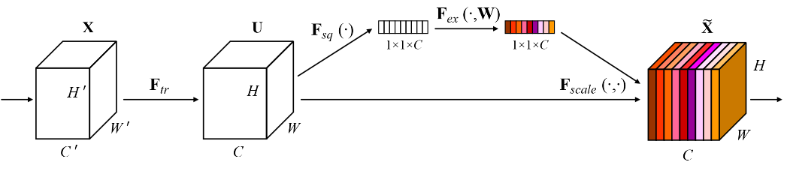
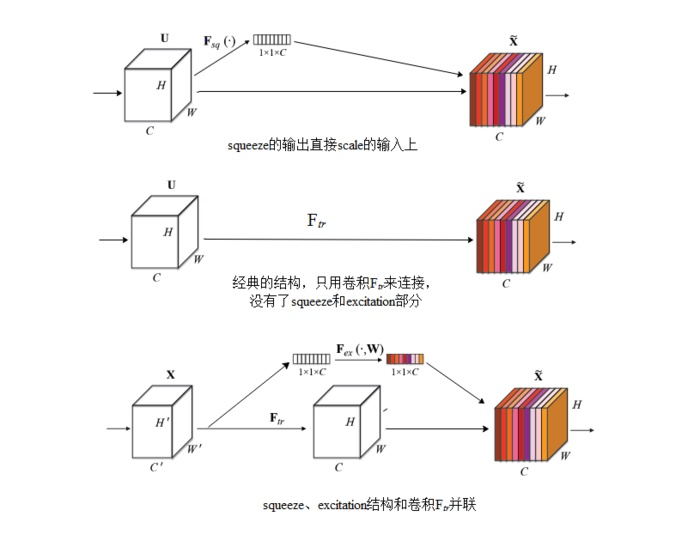
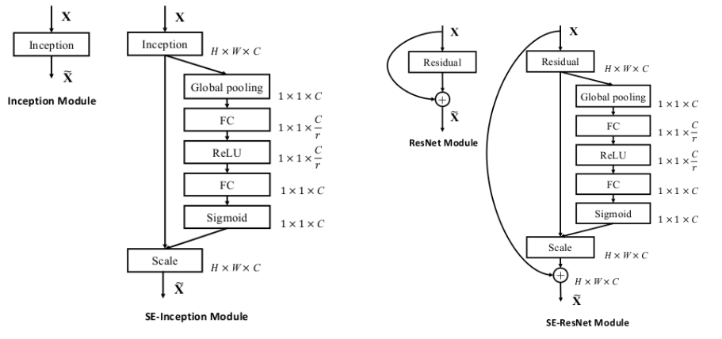
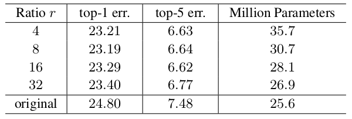
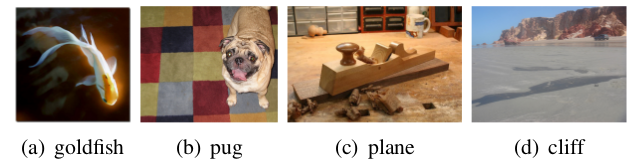
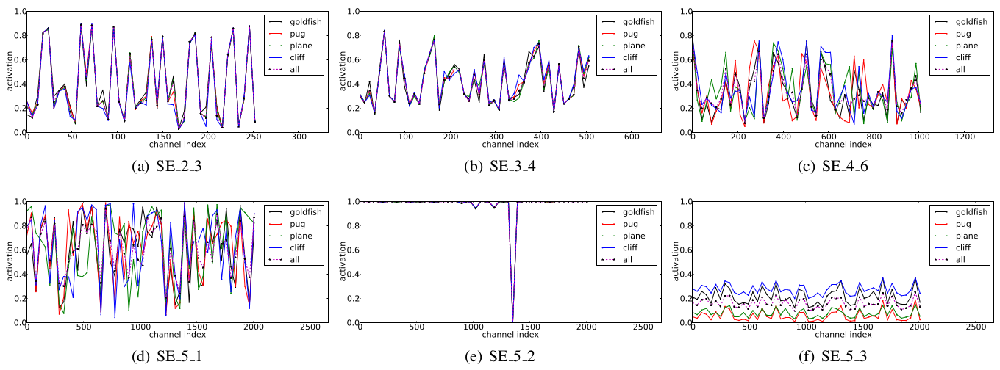

> 论文地址：[Squeeze-and-Excitation Networks](https://arxiv.org/abs/1709.01507v2)
>
> 下述内容主要来自：[知乎](https://zhuanlan.zhihu.com/p/32702350)

# Squeeze-and-Excitation Networks

> 摘要：卷积神经网络的核心就是卷积操作，而卷积操作相当于将"局部感受野"里的空间和通道(维度)信息进行融合来获得新的特征信息。为了增强网络的表示能力（也可以理解为增强网络提取特征的能力），最近一些方法是通过增强空间(HxW)编码来获得提升的。而在这篇文章中，作者主要关注通道之间的关系，并且提出了一种新的结构单元（称为"Squeeze-and-Excitation"（SE）模块），这个模块通过显式地利用各通道之间的相互关系来对各通道的特征进行"重新校准"。作者验证了增加该模块（称为SENet）的网络有很好的提升，且只付出了很少的计算代价。并且该模型获得了2017ILSVRC分类比赛的冠军，它的top-5错误率只有2.251%。

## 1. 结构和原理

上图就是SE模块，下述给出一些说明：

1. $F_{tr}$：卷积操作

2. $F_{sq}(\cdot)$：squeeze过程，这里作者采用简单的全局平均池化来实现（当然可以采用其他一些方式） 。
   作用：将单个通道上面的全部特征信息结合起来，从而不受空间信息的影响

3. $F_{ex}(\cdot, W)$：excitation过程，这部分采用的操作如下所示：
   $$
   s=F_{ex}(z, W)=\sigma(g(z,W))=\sigma(W_2\delta(W_1z))
   $$
   相当于FC+ReLU+FC+Sigmoid。
   作用："建立"各个通道之间的关系，增强重要的通道，减弱不重要的通道

   > 第一个全连接把C个通道压缩成了C/r个通道来降低计算量（后面跟了RELU），第二个全连接再恢复回C个通道（后面跟了Sigmoid），r是指压缩的比例。作者尝试了r在各种取值下的性能 ，最后得出结论r=16时整体性能和计算量最平衡。
   > 为什么要加全连接层呢？这是为了利用通道间的相关性来训练出真正的scale。一次mini-batch个样本的squeeze输出并不代表通道真实要调整的scale值，真实的scale要基于全部数据集来训练得出，而不是基于单个batch，所以后面要加个全连接层来进行训练。

4. $F_{scale}$：就是简单的将excitation过程的输出$s$对$U$进行缩放（下面$s_c$为标量，$u_c$为向量或称为矩阵）
   $$
   \tilde{x}_c=F_{scale}(u_c,s_c)=s_c\cdot u_c
   $$

下面通过SE Block的三种错误结构来进一步帮助理解：

**错误结构1**：squeeze的输出直接scale到输入上，没有了全连接层，某个通道的调整值完全基于单个通道GAP的结果，事实上只有GAP的分支是完全没有反向计算、没有训练的过程的，就无法基于全部数据集来训练得出通道增强、减弱的规律

**错误结构2**：经典的卷积结构，有人会说卷积训练出的权值就含有了scale的成分在里面，也利用了通道间的相关性，为啥还要多个SE Block？那是因为这种卷积有空间的成分在里面，为了排除空间上的干扰就得先用GAP压缩成一个点后再作卷积，压缩后因为没有了Height、Width的成分，这种卷积就是全连接了

**错误结构3**：SE模块和传统的卷积间采用并联而不是串联的方式，这时SE利用的是$F_{tr}$输入$X$的相关性来计算scale，$X$和$U$的相关性是不同的，把根据$X$的相关性计算出的scale应用到$U$上明显不合适。

下面是将SE Block和Inception块（左图）以及ResNet块（右图）结合的情况：

## 2. 实验分析

#### ① Reduction ratio的选取（r值）

下述给出作者对超参数$r$取值的对比分析：

- 从上表可以发现：当$r=16$时，参数量增加不那么多，且top-5 err最低

#### ② Excitation结果分析

我们可以知道Excitation的输出为$1\times 1\times C$，而每一维均可以看做对应通道（代表特征的表征）的重要性。那么我们不妨取网络中不同深度，不同类别的Excitation结果进行分析：

作者采用4个不同类别以及全部类别（上图是这四个类别的例子）输出的Excitation的结果进行对比分析。

上图我们可以得出下述几个结论：

1. 低语义层（如SE_2_3和SE_3_4）：各个类别的曲线差异不大，这说明了在底层语义中scale的分布和输入的类别无关
2. 中层语义（如SE_4_6和SE_5_1）：不同类别的曲线开始出现了差别，这说明靠后的层级的scale大小和输入的类别强相关
3. 高层语义（如SE_5_2和SE_5_3）：到了SE_5_2后几乎所有的scale都饱和，输出为1，只有一个通道为0；而最后一层SE_5_3的通道的scale基本相同。最后两层的scale因为基本都相等，就没有什么用处了，为了节省计算量可以把它们去掉。

