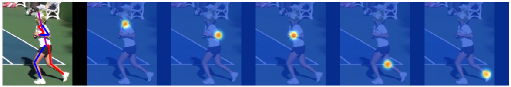
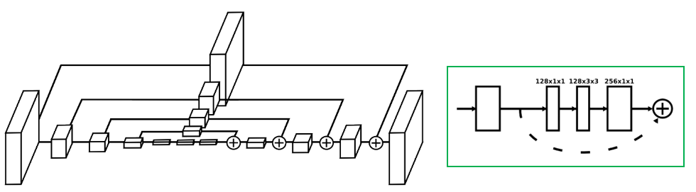
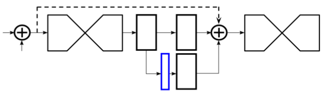
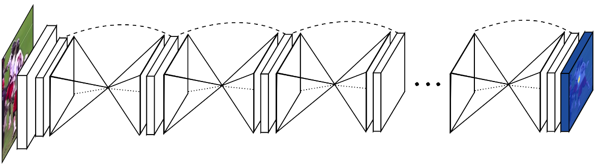

> 论文地址：[Stacked Hourglass Networks for Human Pose Estimation](https://arxiv.org/abs/1603.06937)（ECCV2016）
>
> 下述内容主要来自：[CSDN1](https://blog.csdn.net/qq_36165459/article/details/78321529)，[CSDN2](https://blog.csdn.net/shenxiaolu1984/article/details/51428392)

# Stacked Hourglass Networks for Human Pose Estimation

> 摘要：这篇文章针对人体姿态估计引入了一种新的CNN网络架构。通过将不同"尺度"的特征结合来更好地捕获人体不同空间位置的关系（Features are processed across all scales and consolidated to best capture the various spatial relationships associated with the body）。作者通过实验证明了这种"重复"bottom-up+top-down的处理方式结合中继监督（intermediate supervision）能够显著提高性能。这种"stacked hourglass"结构主要是基于下采样（池化）和上采样（插值）的方式来实现的。这种结构在FLIC和MPII上面均取得了当前最好的效果。

## 1. 结构和原理

> #### 预备知识
>
> 由于这是个人看的第一篇姿态估计的文章，下面先来描述一下这个任务要做的是什么
>
> 
>
> 输入：RGB图像（$H\times W\times 3$）
>
> 输出：关节热度图（$H\times W\times K$）--- 其中每一个$K$代表某个具体的关节。比如假设一个问题中人体共有9个关节，那么采用的$K=9$。（提醒一下，每张关节热度图具体指的是哪个关节是预先定好的）

#### ① Hourglass结构

> 左图是hourglass结构，其中每个方块对应右边的Residule Module结构。其中方块变小一倍采用的都是max pool操作，变大一倍采用的是插值的方式

动机：使用沙漏网络的目的是为了反复获取不同尺度下图片所包含的信息。例如一些局部信息，包括脸部和手部信息。最后的人体姿态估计需要对整个人体做一个理解，因此需要结合不同尺度下的信息，人体的方位，肢体的动作以及相邻关节点的关系。 

#### ② 中继监督（intermediate supervision）

> 上图展示的是两个hourglass结构连接的方案：一个hourglass出来后在和另一个连之前先经过两个Residual Module处理。此外，为了能够使用中继监督，"引出"蓝色这部分（采用1x1卷积将通道数降到K）。这部分也与ground truth构建损失函数。所以相当于有多少个hourglass模块，损失就有几项

动机：思想是来自其他文章，其实简单点说就有点希望"不断加强"的意味。（前面的特征具备"预测"出关节热度图的能力，后续更深入能够进一步提升）

#### ③ 整体结构

1. 前面第一个卷积：$k=7\times 7,s=2$（大小减半），后续再接一个max pool（大小在减半）
2. 为了减少计算代价，输出的关节热度图为$H/4\times W/4\times K$

