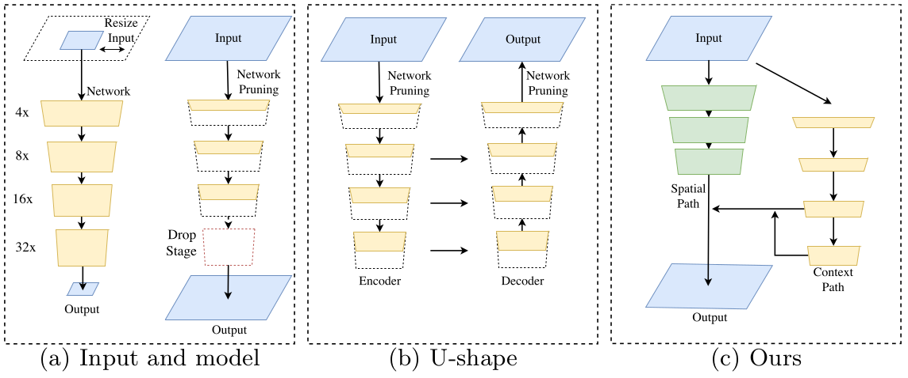
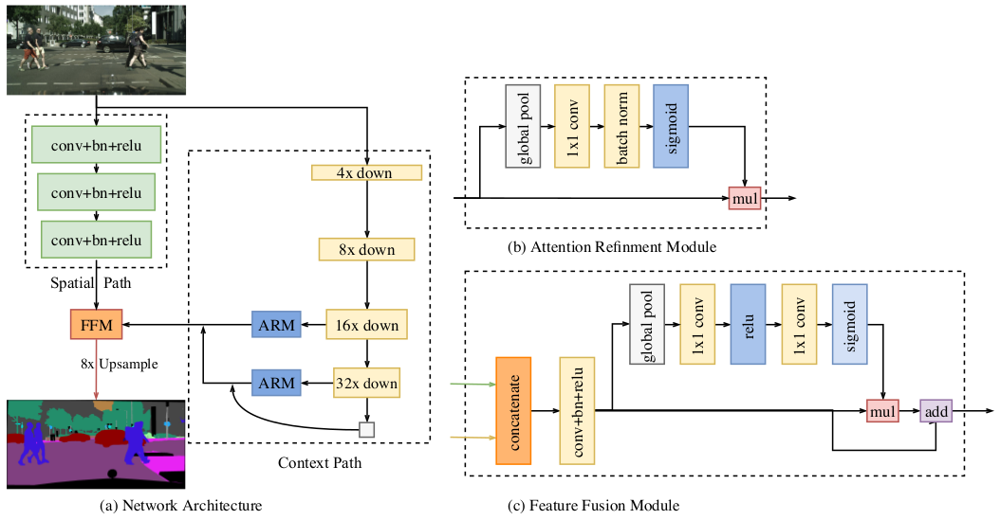
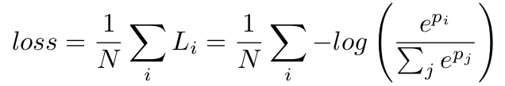
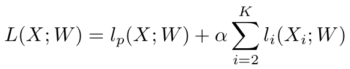
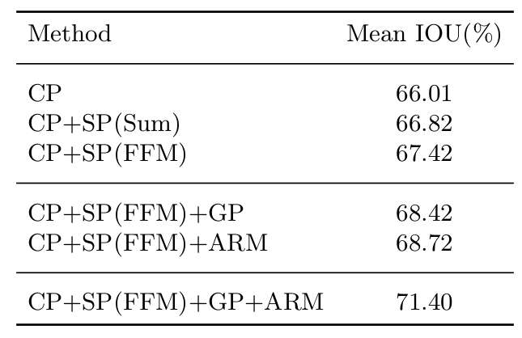
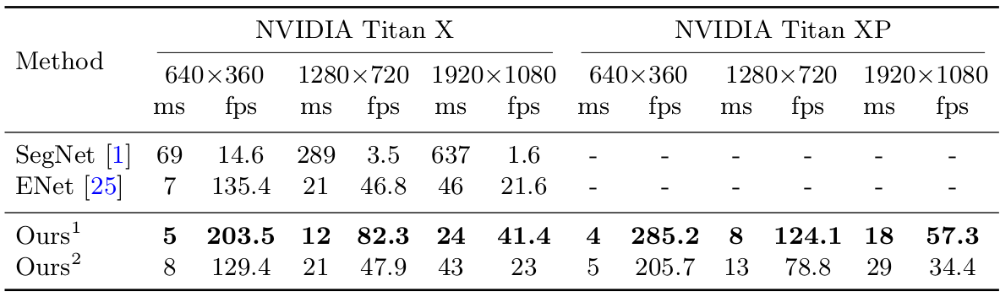
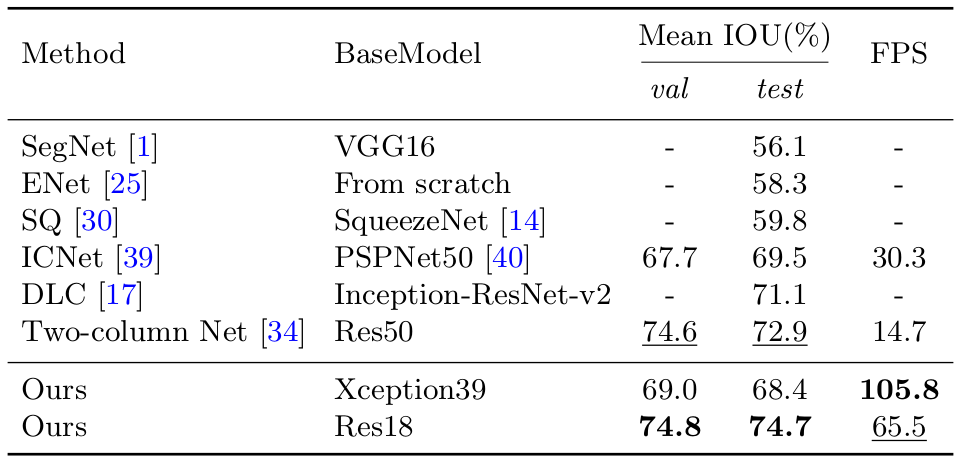
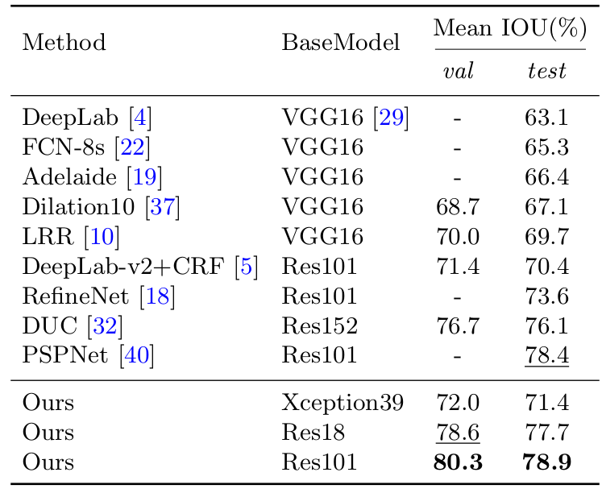

> 论文地址：[BiSeNet: Bilateral Segmentation Network for Real-time Semantic Segmentation](https://arxiv.org/abs/1808.00897)

# BiSeNet: Bilateral Segmentation Network for Real-time Semantic Segmentation

> 摘要：语义分割不仅需要丰富的空间信息，还需要足够大的感受野（主要影响分类性能）。但是当前的大部分方法都是在空间分辨率上做出让步从而达到实时性，但这么做会导致准确率下降。这篇文章中，作者提出了一种新的结构Bilateral Segmentation Network（BiSeNet）来解决效率和准确率之间的"权衡"。主要是利用一个小stride的Spatial Path来保留足够的空间信息（即只进行了较小的下采样）。于此同时，另一路Context Path采用快速的下采样策略来获得足够大的感受野。再利用Feature Fusion Module将这两部分的特征结合起来。这样就能在速度和分割性能上面取得很好的"平衡"。针对2048x1024的输入，该结构能够在Cityspaces测试数据集上取得68.4%Mean IOU，且能够在单张Titan XP上面跑到105FPS，这比与此结构具有相近准确率的结构快的多！

## 1. 结构和原理

下面先来看下三种常用的加快模型"预测速度"的方案：

1. 限制输入图片的大小（可以通过裁剪或者resize --- 如上面图(a)左边所示）：这种方法虽然简单有效，但是会丢失部分空间信息 --- 尤其是在边缘等区域，这会导致最终的准确率显著下降
2. 对通道进行减枝（如上图(a)右边所示）：这会削弱网络每个位置的"表示能力"
3. 类似[ENet](https://arxiv.org/abs/1606.02147)的处理方式，将最后几个下采样层直接丢掉（如上图(a)右边所示）：这会导致最终的感受野较小，这会削弱网络的"判别能力"（分类性能）

以及来看下常用的增强空间信息的方法：

1. 常用U-shape（如上图(b)所示）的结构来增强空间信息表示能力。但这种方法存在下述两个缺点：
   - U-shape会增大较多的计算量（主要是对于高分辨率部分的融合计算等）
   - 如果采用剪枝等处理所导致的空间信息丢失不易重新获取

针对上述问题，作者提出了BiSeNet（上图(c)所示）。其核心设计的出发点：

1. 将空间信息和上下文信息分成两条"并行支路"：这样就能保证两者同时进行计算，提高计算效率
2. 两条支路各司其职，主要关注自己的主要职能（空间信息支路尽可能保证空间分辨率，上下文信息支路尽可能大的感受野和表示能力）
3. 两路网络都尽可能采用轻量级的网络结构
4. 采用融合策略将两路合并起来

### 整体结构

#### ① Spatial Path

这部分非常简单，就如图中**绿色部分**，三个卷积模块（每个的stride=2），将原始图片的分辨率降到1/8。（大量论文里面已经说明1/8的分辨率具备足够空间信息）。

> 显然这部分非常轻量级！！！

#### ② Context Path

这部分采用预训练好的Xception结构（因为它也非常轻量级），在此基础上的几点改动：

1. 将下采样32倍的情况再进行global average pooling操作来获得"全局信息"（相当于"最多的上下文信息了"）
2. 最后三个分支（16x down，32x down，GAP）采用U-shape的结构进行信息融合（这样有助于将"不同程度"的上下文信息进行融合，也有助于稍微保留一些空间信息）
3. 利用了ARM模块：主要有助于帮助获得更好的上下文信息（增强重要的特征通道，减弱不重要的特征通道---这个思想可以认为来自[SENet](https://arxiv.org/abs/1709.01507v2)，当然作者放在这的另一个原因是该部分带来的计算开销很小，且实验证明确实有效果）

> 说白了，各种技巧都是为了获得"更好的"上下文信息。

#### ③ Feature Fusion Module

由于Spatial Path和Context Path两路各个位置的信息的"尺度未必一致"，所以不能直接相加，所有才引入该特征融合模块，该模块主要先concat两部分特征，再利用卷积的方式来"学习具体的融合方式"，且架构主要还是参照自[SENet](https://arxiv.org/abs/1709.01507v2)。

#### ④ 损失函数

分割常规的损失函数就是采用SoftMax，如下所示：

但在此处，增加了auxiliary loss部分（其实目前很多训练结构都会采用这种方式），总的损失如下所示：

其中的$i$代表Xception的第几个阶段（即Context Path），这里作者采用的$K=3$。（那么就是对应8x down和16x down分支，那么我们只需要将这两路的特征再接一个1x1卷积使之输出与类别相同的通道数即可。在与ground truth进行softmax损失即可）

## 2. 实验分析

#### ① 各个模块带来的性能提升

作者采用不同的组合策略，得到的结果：

显然可以看到这几个模块对性能均有提升。

#### ② 运算速度上面的对比

> 其中的Ours1代表Context Path的backbone是Xception39，而Ours2代表Context Path的backbone是Res18

可以发现作者的结构确实速度更快。

#### ③ 效果对比

> 主要是针对2048x1024的输入大小，数据集为Cityspaces上面

显然也可以发现作者的在速度和性能上面均更胜一筹

> Cityspaces上面的结果

这幅图其实想告诉我们，单纯拼性能的话，只要将Context Path上面的backbone采用更深的网络结构，该模型也是不输之前那些state-of-the-art的结构的

