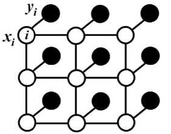

> 关于CRF的文章：[Efficient Inference in Fully Connected CRFs with Gaussian Edge Potentials](https://arxiv.org/pdf/1210.5644.pdf)（大部分实现均是基于这个版本），[An Introduction to Conditional Random Fields](http://homepages.inf.ed.ac.uk/csutton/publications/crftut-fnt.pdf) ，[CRF知乎](https://www.zhihu.com/question/35866596)
>
> CRF的实现：[PyDenseCRF](https://github.com/lucasb-eyer/pydensecrf)

# Conditional random field

## CRF在语义分割上的应用

传统上，CRF已被用于平滑噪声分割图。通常，这些模型包含耦合相邻节点的能量项，有利于相同标签分配空间近端像素。定性的说，这些短程的CRF主要功能是**清除在手工特征基础上建立的弱分类器的虚假预测**。

与这些弱分类器相比，现代的DCNN体系产生质量不同的预测图，通常是比较平滑且均匀的分类结果(即以前是弱分类器预测的结果，不是很靠谱，现在DCNN的预测结果靠谱多了)。在这种情况下，使用短程的CRF可能是不利的，因为我们的目标是恢复详细的局部结构，而不是进一步平滑。而有工作证明可用全连接的CRF来提升分割精度。

对于每个像素位置$i$具有隐变量$x_i$(这里隐变量就是像素真实类别标签，如果预测结果有21类，则$(i∈1,2,..,21)$，还有对应的观测值$y_i$(即像素点对应的颜色值)。以像素为节点，像素与像素间的关系作为边，构成了一个条件随机场(CRF)。通过观测变量$y_i$来推测像素位置$i$对应的类别标签$x_i$。条件随机场示意图如下

条件随机场符合吉布斯分布($x$是上面的观测值，下面省略全局观测$I$)：
$$
P(x|I)=\frac{1}{Z}\exp(-E(x|I))
$$
全连接的CRF模型使用的能量函数$E(x)$为：
$$
E(x)=\sum_{i}\theta_i(x_i)+\sum_{ij}\theta_{ij}(x_i,x_j)
$$
这分为一元势函数$\theta_i(x_i)$和二元势函数$\theta_{ij}(x_i,x_j)$两部分.

- 一元势函数是定义在观测序列位置$i$的状态特征函数，用于**刻画观测序列对标记变量的影响**。在这里定义为:
  $$
  \theta_i(x_i)=-\log P(x_i)
  $$
  说白了，就是我们观测到像素点$i$的当前像素为$y_i$，则其对应为标签$x_i$的概率值(例如在城市道路任务中，观测到像素点为黑色，对应车子的可能比天空可能要大)。以前这个一元势函数是通过一些分类器完成的，现在DeepLab中有了DCNN来做像素分割，**故这里$P(x_i)$是取DCNN计算关于像素$i$的输出的标签分配概率。**

- 二元势函数是定义在不同观测位置上的转移特征函数，用于**刻画变量之间的相关关系以及观测序列对其影响**。在这里定义为:
  $$
  \theta_{ij}(x_i,x_j)=\mu(x_i,x_j)\sum_{m=1}^K\omega_m  k^m(f_i,f_j)
  $$

  - 其中$if\ x_i\ne x_j$则$\mu(x_i,x_j)=1$；否则$\mu(x_i,x_j)=0$。因为是全连接，所以每个像素对都会有值.

    - $k^m(f_i,f_j)$是$(f_i,f_j)$之间的高斯核，$f_i$是像素$i$的特征向量，例如像素点$i$的特征向量$f_i$用$(x,y,r,g,b)$表示。对应的权重为$\omega_m$

    - 在DeepLab中高斯核采用双边位置和颜色组合，式为
      $$
      \omega_1\exp(-\frac{||p_i-p_j||^2}{2\sigma_{\alpha}^2}-\frac{||I_i-I_j||^2}{2\sigma_{\beta}^2})+\omega_2\exp(-\frac{||p_i-p_j||^2}{2\sigma_{\gamma}^2})
      $$
      第一核取决于像素位置($p$)和像素颜色强度($I$)，第二个核取决于像素位置($p$).

  说白了**，二元势函数是描述像素和像素之间的关系，**如果比较相似，那可能是一类，否则就裂开，这可以细化边缘。一般的二元势函数只取像素点与周围像素之间的边，这里使用的是全连接，即像素点与其他所有像素之间的关系。

这个公式看起来是很麻烦的，实际上计算时分解近似的平均场然后再计算，感兴趣可参考对应论文.