> 论文地址：[Dual Attention Network for Scene Segmentation](https://arxiv.org/abs/1809.02983)
>
> 感觉最新的几篇文章都是在想如何将attention机制放进去...但其实感觉都属于"意识流"

# Dual Attention Network for Scene Segmentation

> 在这篇文章中，作者通过self-attention机制来帮助场景分割任务更好的捕获上下文信息。不同于之前将不同尺度的上下文信息融合，这里是利用attention机制来集成局部特征和与之关联的全局信息（采用的整个网络架构为Dual Attention Networks---DANet）。特别的是，作者在之前的dilated FCN尾巴后面添加两个不同的attention模块；分别用来捕获spatial和channel各自方向存在的语义相关性。其中的position attention模块利用当前像素与各个像素之间的相关性来，来进行"针对性"的增强（即与之越相关的对其影响越大，而忽视像素点之间的距离）；同样的，每个通道与所有通道之间建立"联系"，将关联性越强的通道之间施加的影响越大。最后，作者将这两个attention模块的结果进行相加来进一步提升特征的表达能力。作者在Cityspaces，PASCAL Context和COCO stuff数据集上均取得了当前最好的结果。尤其是在Cityspaces的测试集上取得了81.5%的效果。具体代码请见：[DANet](https://github.com/junfu1115/DANet)

## 1. 内容目录

- Attention模块（Position Attention和Channel Attention）
- DANet整体架构
- Ablation实验

## 2. Attention模块

#### **Position Attention Module**

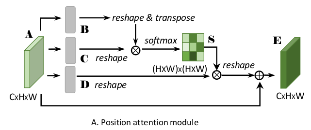

这个attention模块主要"刻画其他所有位置"和当前位置之间的关系（比如当前点是汽车，我们当然希望画面中所有汽车点的特征尽可能相近---这点是原本FCN存在的问题，相同类别的特征存在蛮大的差异）

step1：A→(B,C,D)

输入特征A通过卷积分别获得B，C，D（这里采用的卷积是否共享参数文章中好像没介绍）。这三者的大小均为$H\times W\times C$。

> 其中的B可以看做keys，C看做querys，D看做values

step2：建立相关性矩阵S

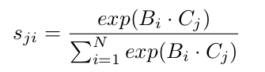

> $S\in R^{N\times N}$，说白了此处的相似度定义为$a^Tb$

$S_{ji}$代表位置i和位置j之间的相似性。

step3：输出"融合特征"

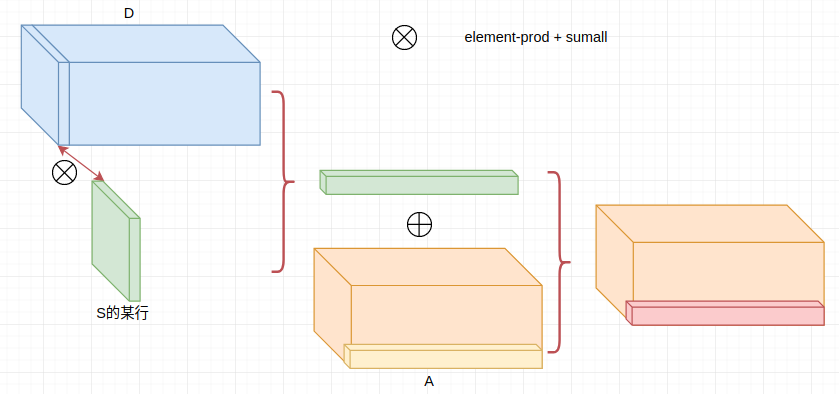

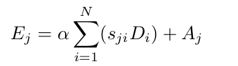

> 其中的$\alpha$初始化为0，训练过程中逐步增大

#### **Channel Attention Module**

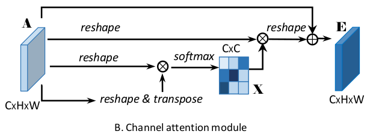

这个模块主要刻画不同通道之间的相关性。在高语义情况下，不同通道往往代表着不同的类别（即某个通道被激活的强烈一点，代表越有可能是某种类别），而我们建立通道之间的相关性，其实在某种意义上反映的是类别之间的相关性（比如存在车的情况下，存在马路的可能性也会更高）

step1：建立通道相关矩阵

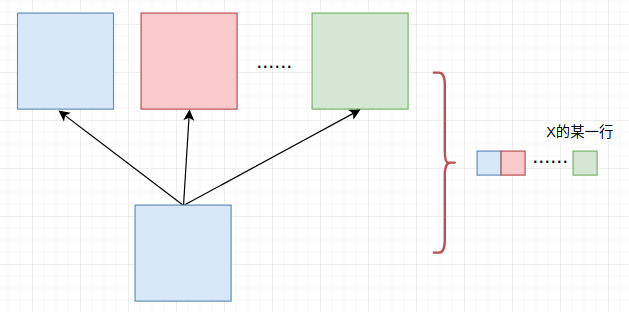

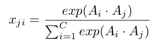

> $x_{ji}$反映的是通道$j$和$i$之间的相关性（$X\in C\times C$）

step2：输出"特征"

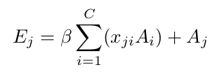

> 初始的时候$\beta=0$，训练过程中逐渐增大

#### 可视化结果来看这两个模块的效果

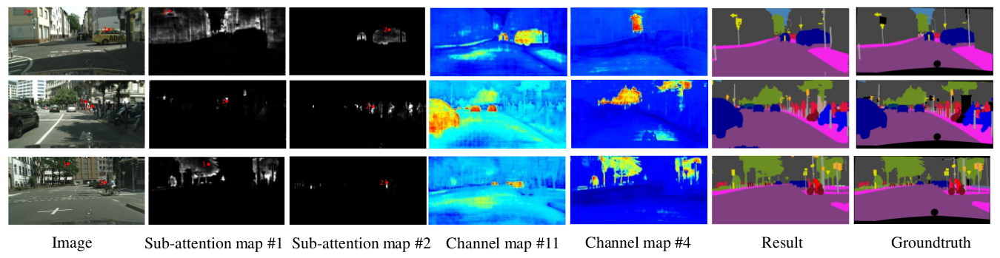

说明：

- Sub-attention map#1和#2分别对应点1和点2对应的位置相关矩阵S上对应行的可视化结果，我们可以明显的发现它会凸显相同类别的物体
- Channel map#11和channel map#4分别对应输出的E矩阵（channel attention module）的两个不同通道，我们可以发现通道确实对应类别的信息，#11显然更对应汽车类别，而#4更对应树等类别

## 3. DANet整体架构 

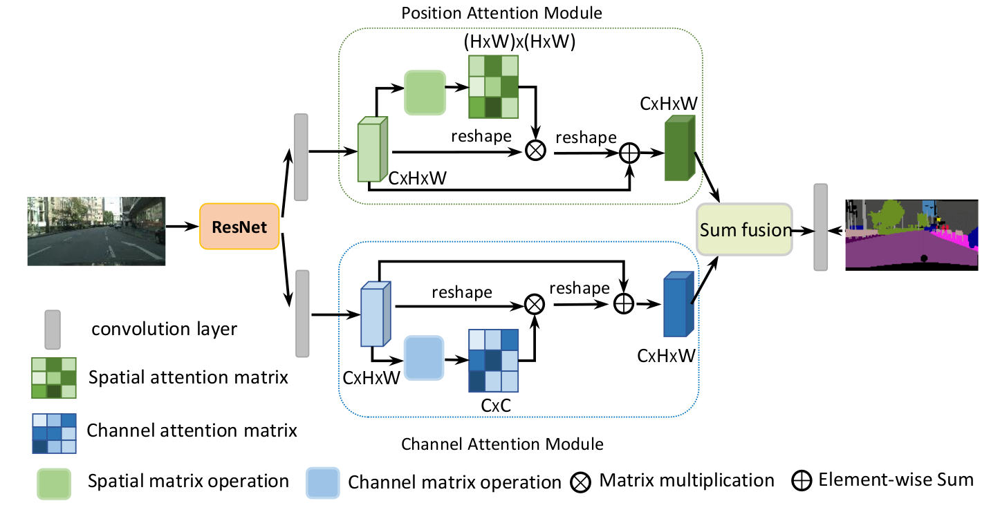

其实也没啥好讲的，就提几个点：

1. ResNet后面几层去掉pool层改成dilated卷积，最后的缩放倍数为1/8
2. sum fusion，就是element-add

## 4. Ablation实验

#### ① 各个Attention Module带来的影响

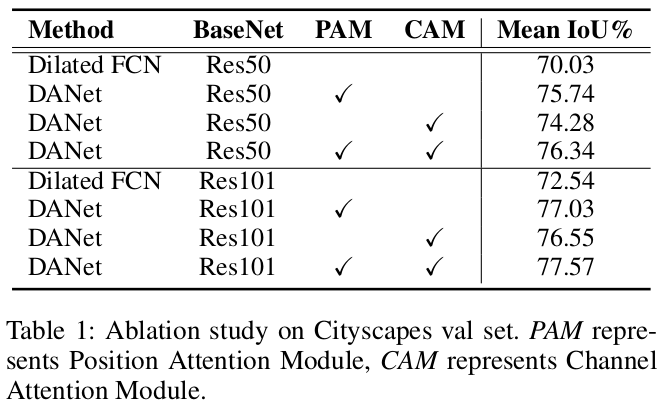

可以发现PAM和CAM两个attention module均能带来性能提升，且融合起来效果最好

#### ② 几种训练策略集成

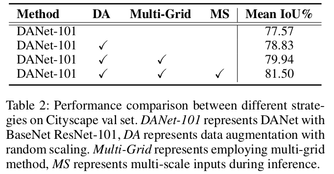

- DA：数据集增强
- Multi-Grid：多尺度
- MS：测试阶段多尺度

