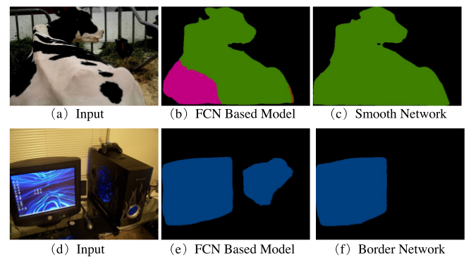
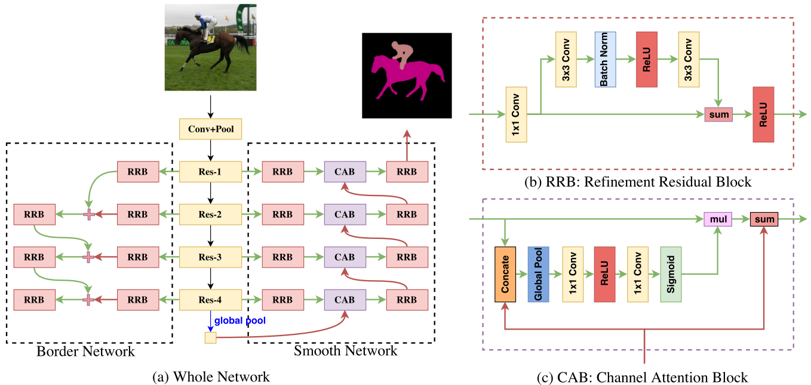
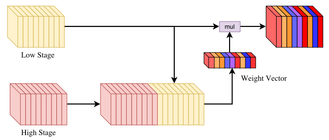
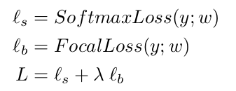

> 论文地址：[Learning a Discriminative Feature Network for Semantic Segmentation](https://arxiv.org/abs/1804.09337)

# Learning a Discriminative Feature Network for Semantic Segmentation

> 摘要：目前大多数语义分割方法依然面临两大问题 --- ① 类内不一致 ② 类间难以辨别。为了解决这两个问题，作者提出了Discriminative Feature Network（DFN），该网络结构包含两个子网络：Smooth Network和Border Network。其中为了解决类内不一致问题，作者设计了包含Channel Attention Block和global average pooling结构的Smooth Network来更好的辨别特征。此外，采用Border Network对语义轮廓（semantic boundary）进行有监督训练，从而使得边缘轮廓更明确。基于DFN，作者在PASCAL VOC2012和Cityspaces数据集上分别取得了86.2%和80.3%的结果。

## 1. 结构和原理

首先先来解释下什么是**类内不一致**和**类间难以辨别**：

1. 类内不一致：如上图第一行(b)所示，同类物体却被分成了两类(绿色和红色)，这就是类内不一致
2. 类间难辨别：如上图第二行(b)所示，显示器和主机之间非常类似（如图中全是黑色）；很容易导致将不同类划分成了同一类

下面来看看作者是如何解决上述两个问题的。

> 其中的**红线**代表上采样，而**蓝线**代表下采样，而**绿线**就是直接连接

#### ① Smooth network：解决类内不一致

首先我们来思考下造成类内不一致的原因是什么：主要原因是"上下文信息"不够，那么解决方法也就是针对"上下文信息"进行处理。那么什么样的"上下文信息"最足够呢，显然是全局的（比如分类问题），可对应的空间位置信息就不准确了～所以作者在这里采用"V结构"的Smooth Network来解决。

主要的几个创新点：（很多方法为了增强上下文信息采用U-Net的结构来"增强"语义信息和空间信息）

1. 加入了global pool这一部分，将"语义信息"发挥到了极致
2. 不是简单的将相邻stage的特征进行融合。而是通过CAB结构利用相邻stage的信息来决定当前stage哪些通道的特征需要增强，而哪些通道的特征需要减弱。再将权值化后的特征与上一级的特征进行相加（主要是为了让语义信息更充分的保留下来）
3. 训练的时候对各个stage的情况均进行有监督训练（除了global pool那一stage除外）

> 注：其中的channel attention block具体的方式如下图所示：
>
> 

#### ② Border network：解决类间不一致

这部分作者采用的方式"很特别"：将各个物体的轮廓的出来（对ground truth采用Canny算子等边缘算子来获得轮廓的ground truth），然后进行轮廓的有监督学习。（这样做可以很好的将不同类别的物体分离开来）

主要的几个创新点：

1. 采用bottom-up的结构：作者认为低层语义特征具备更多细节信息，而高层特征具备更多的语义信息。而在这里的工作，作者更希望易于轮廓具备更多语义信息（这部分个人还是不太理解，感觉看到的轮廓分割大部分也是采用up-bottom的形式）
2. 采用Focal Loss来客服前景背景数目像素点数目造成的训练数据不平衡问题

> 这里应该是每个类别的轮廓分开？

将上述结合起来，最后的损失函数如下所示：

## 2. 结果分析

#### ① Smooth network对比分析

1. 增加global pooling（GP）
2. 针对不同stage均对应有监督学习（DS）
3. 增加Channel Attention Block模块（CAB）
4. RRB：Refinement Residual Block

#### ② Border network对比分析

1. BN：加上Border network
2. MS_Flip：增加mutli-scale inputs和left-right flipped inputs

> 感觉Border network效果并没有那么惊艳

