> 下述内容主要来自：[DFan的博客](http://hellodfan.com/2018/01/22/%E8%AF%AD%E4%B9%89%E5%88%86%E5%89%B2%E8%AE%BA%E6%96%87-DeepLab%E7%B3%BB%E5%88%97/)，[PPT](http://web.eng.tau.ac.il/deep_learn/wp-content/uploads/2017/12/Rethinking-Atrous-Convolution-for-Semantic-Image-Segmentation-1.pdf)

# DeepLab系列

## 1. DeepLab系列针对的Task

DeepLab是针对语义分割(Semantic Segmentation)任务提出的深度学习系统：

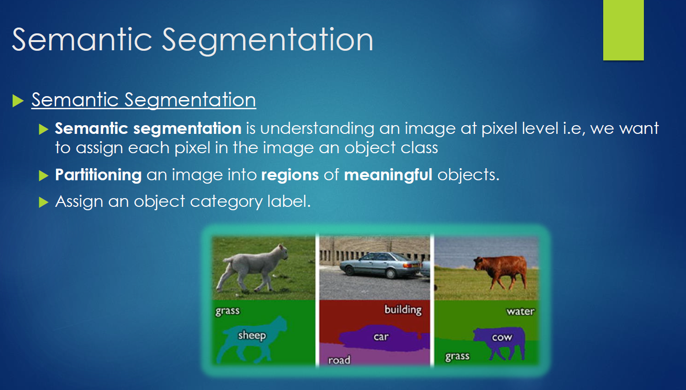

语义分割的要求：

- 语义分割是对图像做密集的分割任务，分割每个像素到指定类别上
- 将图像分割成几个有意义的目标
- 给对象分配指定类型标签

语义分割的用途：

- 自动驾驶
- 医疗辅助

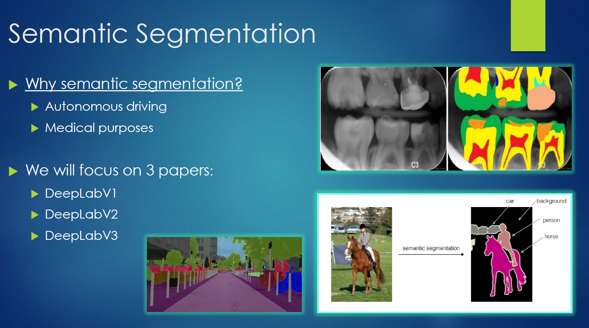

## 2. DeepLabv1 & DeepLabv2

- 使用DCNN做密集的分类任务，产生的预测图有目标大概的位置，但比较粗糙
- 使用条件随机场(CRF)细化分割结果

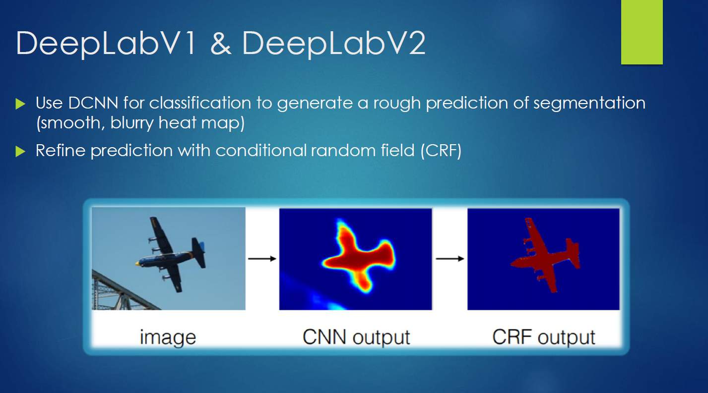

### 核心解决思路

| 对于标准的DCNN有哪些问题？              | 针对这些问题，DeepLab的解决办法 |
| --------------------------------------- | ------------------------------- |
| 1.**分辨率**： 输出特征分辨率较小       | 1.使用空洞卷积                  |
| 2.**池化**： 对于输入变换具有内在不变性 | 2. 使用CRF                      |

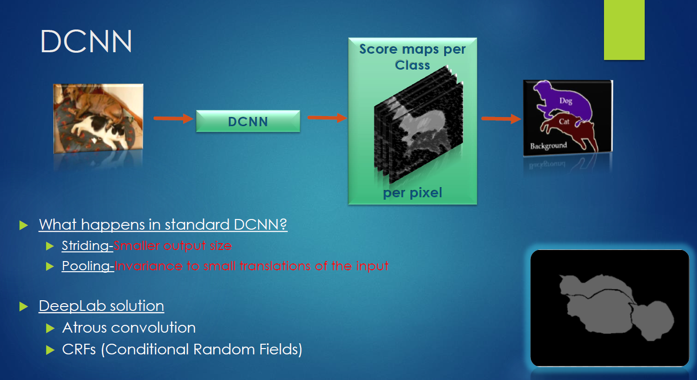

#### DCNN中使用空洞卷积

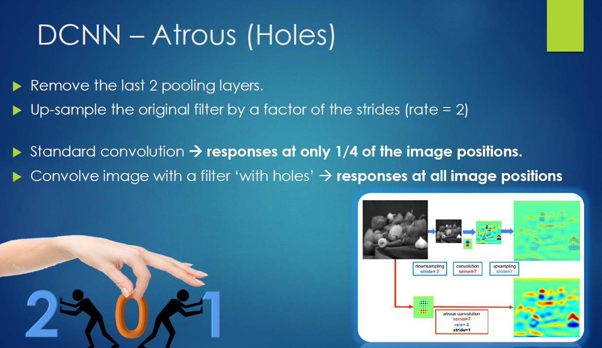

- 移除原网络最后两个池化层
- 使用rate=2rate=2的空洞卷积采样

如上图右下所示，标准的卷积只能获取原图1/4的内容，而新的带孔卷积可以在全图上获取信息。

> 上图右下的上面：下采样+卷积+上采样的结果；上图右下的下面：空洞卷积
>
> 我们可以发现采用空洞卷积替换池化后再上采样的过程能够更好的保留信息

DeepLabv1到DeepLabv2有一个变化：

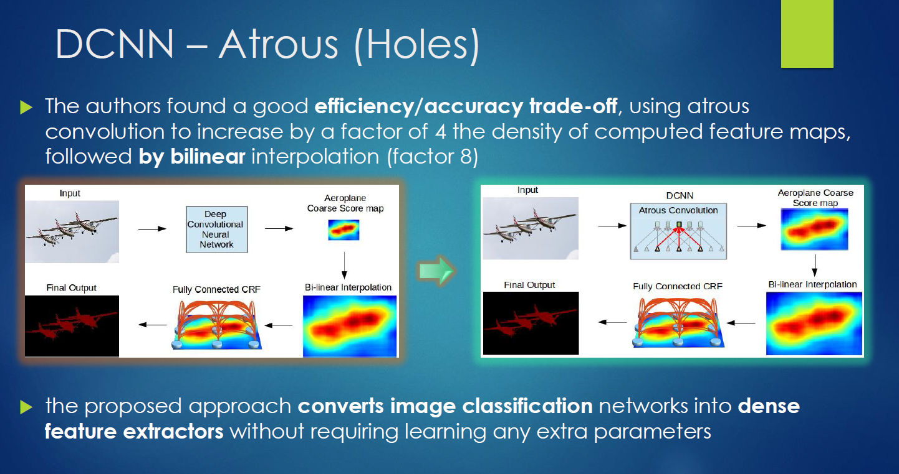

由左边到右边，主要是在DCNN中应用了空洞卷积密集的提取特征，左边的输出步幅是16，需要上采样16倍得到预测结果，可以看到结果是比较模糊的；而右边是在DCNN中使用空洞卷积，保持步幅为8，只需要上采样8倍，结果清晰了很多。

> 个人感觉这种比较也没那么公平吧:cry:～

#### CRF部分

DCNN存在分类和定位之间的折中问题，预测到目标的大概位置但比较模糊。

CRF尝试找到图像像素之间的关系： 相近且相似的像素大概率为同一标签；CRF考虑像素的概率分配标签；迭代细化结果。

### 模型结构介绍

#### DeepLabv1结构介绍

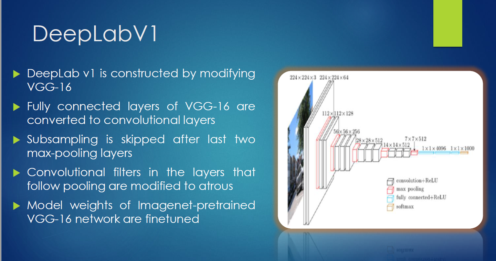

DeepLabv1是在VGG16的基础上做了修改：

- VGG16的全连接层转为卷积
- 最后的两个池化层去掉了下采样
- 后续卷积层的卷积核改为了空洞卷积
- 在ImageNet上预训练的VGG16权重上做finetune

可视化结果如下：

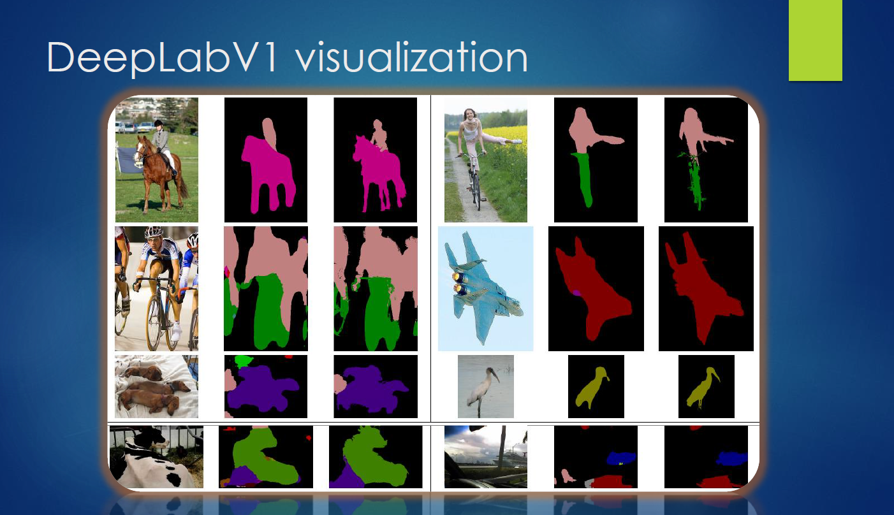

#### DeepLabv2结构介绍

DeepLabv2在DeepLabv1上做了改进：

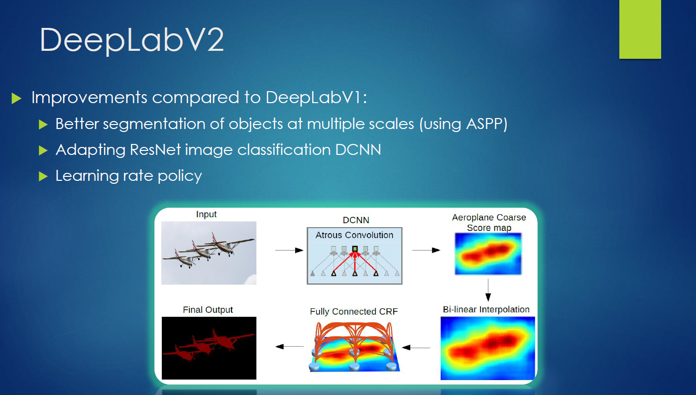

- 用多尺度获得更好的分割效果(使用ASPP)
- 基础层由VGG16转为ResNet
- 使用不同的学习策略(poly)

##### ASPP模块

| 为什么要提出ASPP？               | 解决思路                                         | 实施办法                         |
| -------------------------------- | ------------------------------------------------ | -------------------------------- |
| 语义分割挑战：在多尺度上存储目标 | 在给定的特征层上使用不同采样率的卷积有效的重采样 | 使用不同采样率的空洞卷积并行采样 |

ASPP中在给定的`Input Feature Map`上以$r=(6,12,18,24)$的$3×3$空洞卷积并行采样。

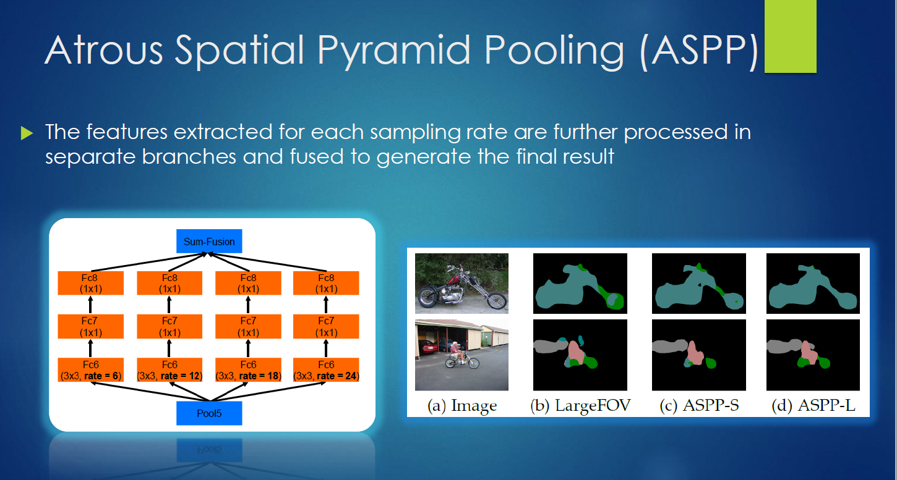

ASPP各个空洞卷积分支采样后结果最后融合到一起(通道相同，做像素加)，得到最终预测结果.

DeepLabv2可视化结果：

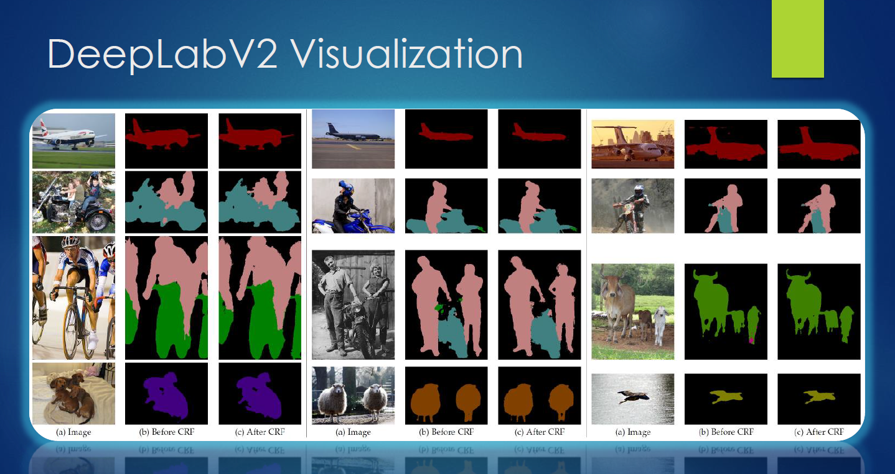

### DeepLabv1 & DeepLabv2优势

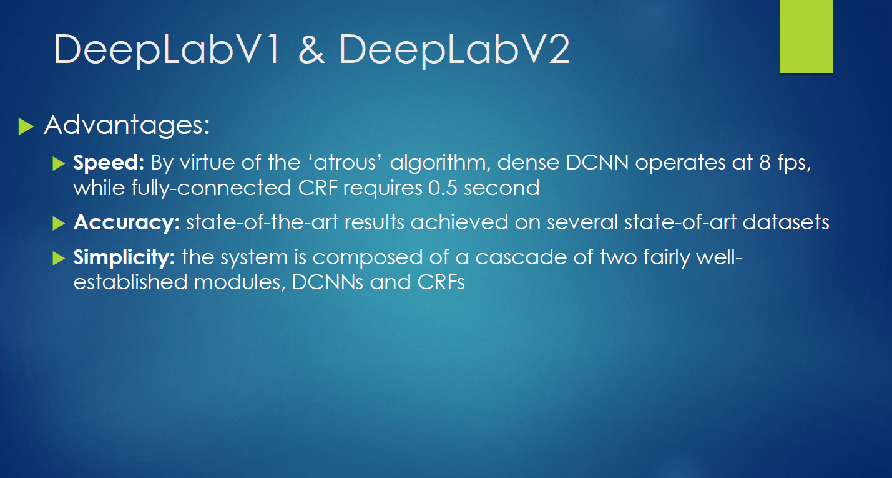

- 速度上： 使用空洞卷积的Dense DCNN达到8fps，全连接的CRF需要0.5s
- 精准度：在几个先进的数据集上达到了先进的结果
- 建议性：系统由两个成熟的模块组成，DCNNs和CRFs

## DeepLabv3

### 相比DeepLabv1 & DeepLabv2的改变

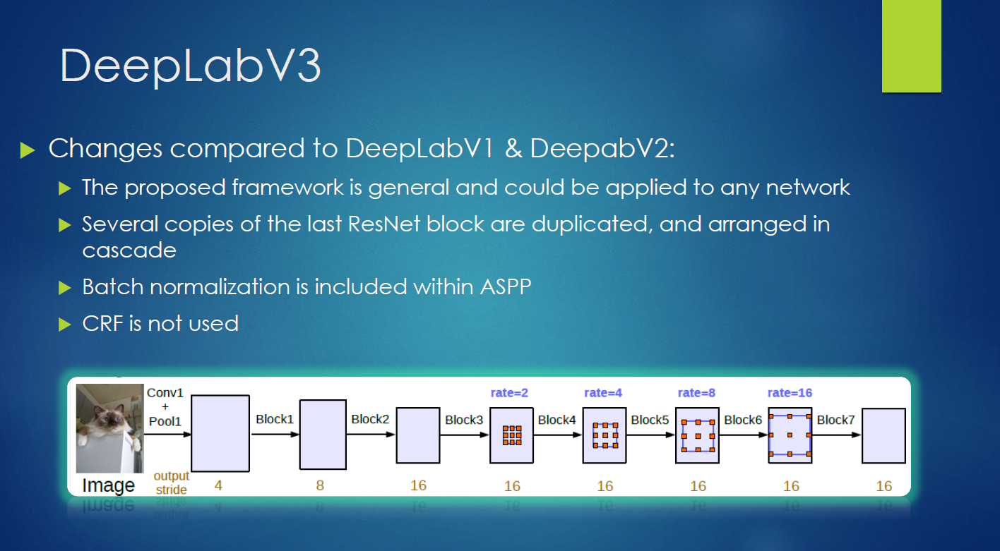

- 提出了更通用的框架，适用于任何网络
- 复制了ResNet最后的block，并级联起来
- 在ASPP中使用BN层
- **没有**使用CRF

### 模型结构介绍

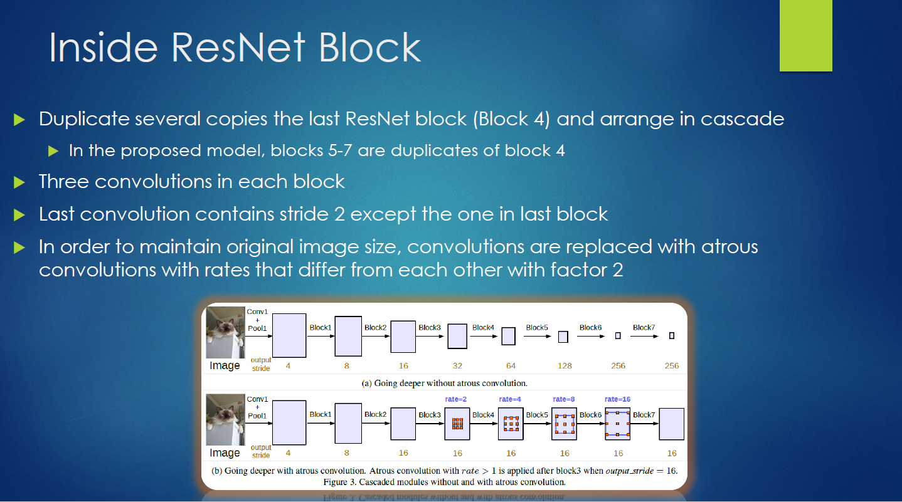

- 复制ResNet最后一个block多个副本，级联到一起
  - 在本文中,block5-7是block4的副本
- 每个block中包含三个卷积(使用Mutli-gird策略)
- 最后一个block的最后一个卷积步长为2(???)
- 为了维持原图尺寸，使用不同的采样率(每层采样率乘2)空洞卷积代替原卷积

#### ASPP模块

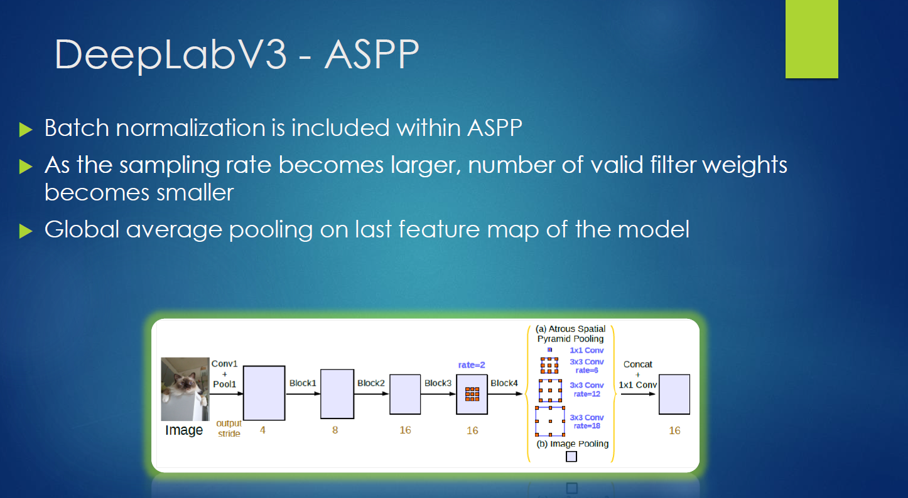

相比于DeepLabv2的ASPP模块，有以下变化和问题：

- ASPP中应用了BN层
- 随着采样率的增加，滤波器中有效的权重减少了(有效权重减少，难以捕获原距离信息，这要求合理控制采样率的设置)
- 使用模型最后的特征映射的全局平均池化(为了克服远距离下有效权重减少的问题)

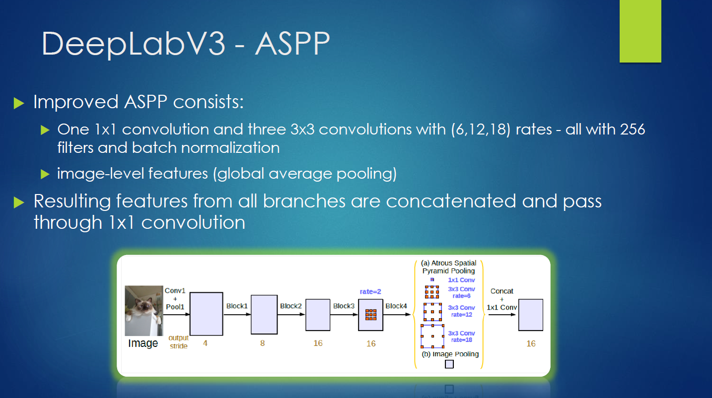

新的ASPP模块包括：

- 一个$1×1$卷积和3个$3×3$的空洞卷积(采样率为$(6,12,18)$)，每个卷积核都有256个且都有BN层
- 包含图像级特征(即全局平均池化)

所有分支得到的结果通过$1×1$卷积级联到一起得到最终结果。

### DeepLabv3的实验结果

在PASCAL VOC 2012测试集上，相比于DeepLabv2的77.69%，DeepLabv3有2%的提升：

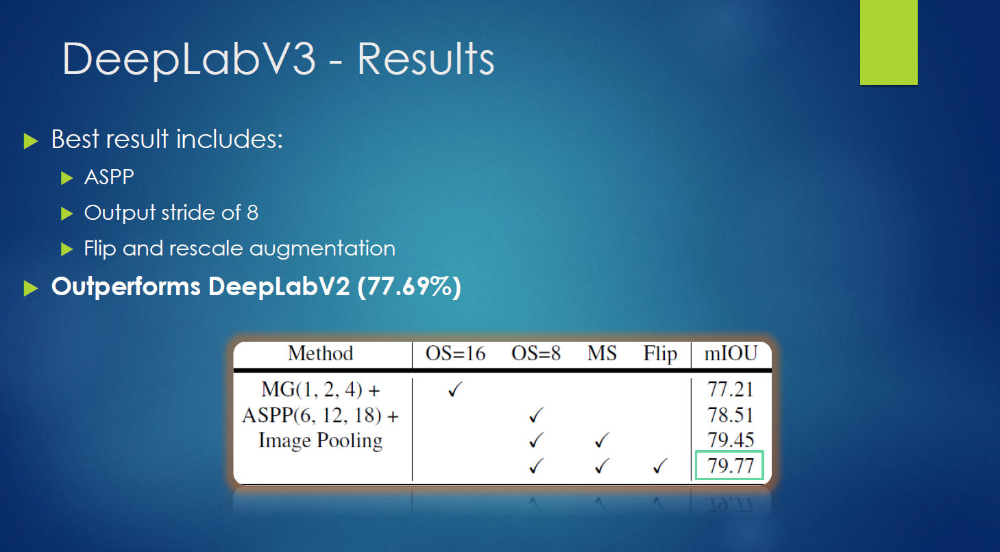

最好的结果包含：

- ASPP
- 输出步幅为8
- 翻转和随机缩放的数据增强

可视化结果：

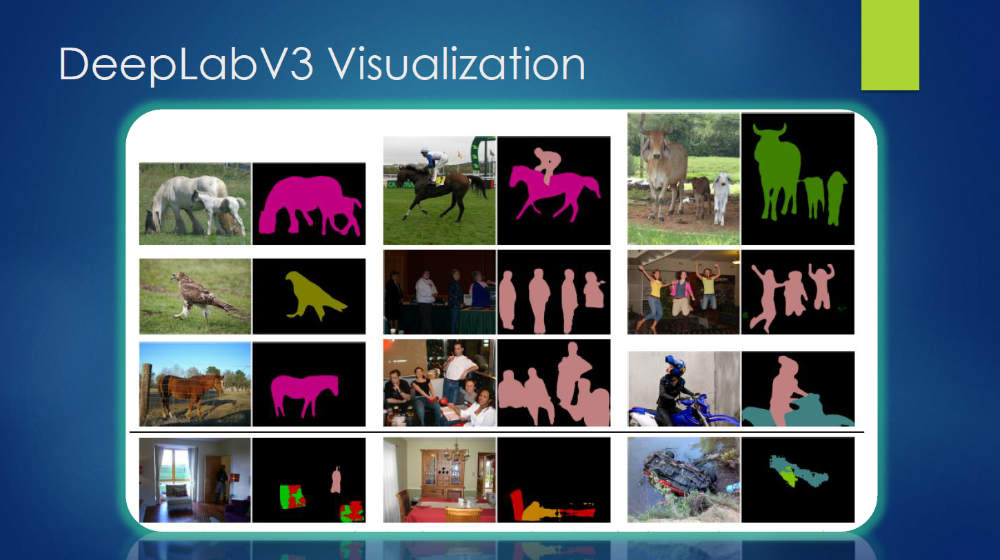

