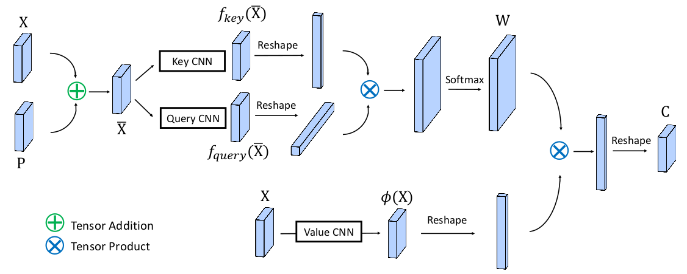
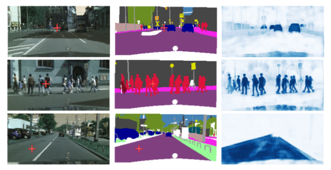
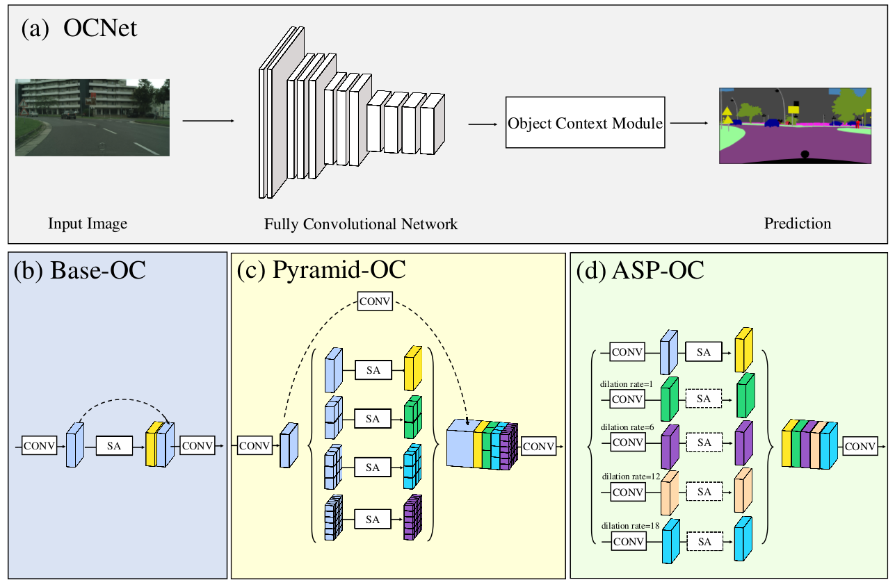
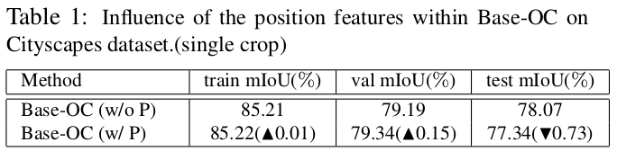
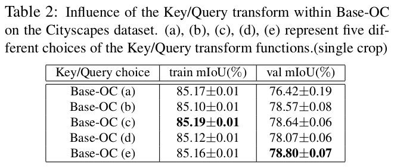
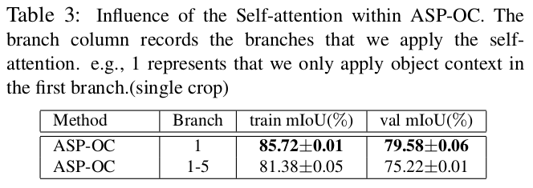
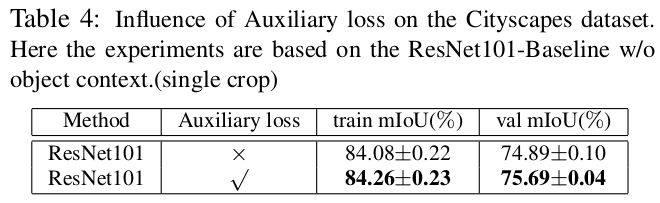
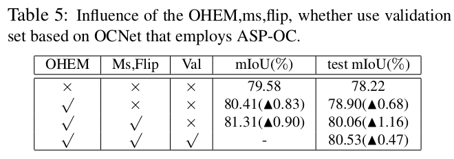

> 论文地址：[OCNet: Object Context Network for Scene Parsing](https://arxiv.org/abs/1809.00916)
>
> 作者的知乎"详解"：[Object Context：通往更好的场景分割算法](https://zhuanlan.zhihu.com/p/43902175)

# OCNet: Object Context Network for Scene Parsing

> 在计算机视觉任务中，上下文信息是至关重要的。目前最好的场景分割方法充分利用了图像层面(image level)的上下文信息来帮助分割。这种上下文信息是将属于不同类别的物体信息全都混合在一起考虑。
>
> 每个像素P的标签定义为该像素所属的类别，作者提出了一种新的"物体上下文信息"：某个像素P的"物体上下文信息"=与P所属同类别的所有像素的信息。又由于像素P到底属于哪个类别我们是不知道的（测试阶段我们没有ground truth），作者采用"自注意力机制"（self-attention）来学习每个像素对应的"相似map"（所有像素哪些和该像素属于同类别）
>
> 作者进一步提出了Pyramid Object Context和Astrous Spatial Pyramid Object Context来进一步帮助捕获不同尺寸的上下文信息。基于物体的上下文信息，作者提出了OCNet，并且在Cityspaces和ADE20K上面均取得了当前最好的效果。代码实现见[OCNet](https://github.com/PkuRainBow/OCNet)

## 1. 目录

- 物体上下文信息（Object Context结构）
- OCNet框架
- Ablation Study

先给出一些符号定义：

- $X\in \mathbb{R}^{N\times d}$：输入的feature map，其中$N=H\times W$，$d$代表通道数
- $y\in\mathbb{R}^{N\times 1}$：标签（ground truth）
- $P\in\mathbb{R}^{N\times d}$：position map
- $C\in\mathbb{R}^{N\times d_c}$：获得的object context
- $W\in \mathbb{R}^{N\times N}$：每行代表某个像素对应的similarity map（即可以认为是"attention"认为两个像素所属类型是否相同的概率）

## 2. 物体上下文信息

理想情况下的"Object Context"定义如下：
$$
c_i=\sum_{j=1}^N \mathbb{I}[y_i=y_j]\phi(x_j)
$$

> 即将所有与像素$i$标签相同的像素的"信息"结合起来 

但是现在的问题是$y$我们其实是不知道（主要考虑到预测阶段），所以将"Object Context"定义为：
$$
c_i=\sum_{j=1}^N w_{i,j}\phi(x_j)
$$

> 其中$\sum_{j=1}^N w_{i,j}=1$，$w_{i,j}$反映像素$i,j$所属同类别的可能性

下面就是思考如何定义$w_{i,j}$（这个其实就是attention-based model里面定义match）。这篇文章里面作者给出的定义如下：
$$
w_{i,j}=\Phi(\bar{x}_i,\bar{x}_j)=\frac{exp(f_{query}(\bar{x}_i)^T f_{key}(\bar{x}_j))}{C(\bar{x}_i)}
$$

> 其中的$\bar{x}_i=x_i+p_i$，以及此处的$\Phi$和前面的$\phi$是不同的哦

上面的表达式表示成网络结构就如下所示：

> 个人其实有个小困惑，这个W有点大呀，虽然它不需要学参数(参数来自前面的key cnn和query cnn)，但是在前向传播的过程中构建计算图感觉还是很耗内存。

几点主要事项：

1. 作者在实现中其实并没有采用P的信息（即P不要） --- 主要是因为实验发现并没有提升

   > 但或许可以定义更合适的"位置信息"

2. 其中的Key CNN和Query CNN参数共享：结构为1x1卷积+BN+ReLU（没有为什么，还是实验比较发现这种结构性能最好---但其实细想一下key和query在里面本身应该也应该是通用的）

作者做了实验说明该结构的结果确实如"预期一样"：

> 其中的红色十代表选择的像素P，然后第三列代表的是该像素对应的similarity map（其实就是W对应P的那一行），我们可以发现确确实实同类别的均被"突出显示了"（不仅仅是那些countable的物体，如人和车，也能处理uncountable物体，如马路）

## 3. OCNet框架

说明：

1. Fully Convolutional Network作者采用的是ResNet101，且采用dilated conv来增强感受野（只将图片缩小了1/8）
2. Bases-OC对应"最朴素的方式"，Pyramid-OC对应PSPNet里面的Pyramid结构，ASP-OC对应DeepLabv3里面的ASPP结构：其中的SA就是在2里面介绍的Object Context结构（self-attention的简写）

## 4. Ablation分析

1. Positional Feature的影响：position feature没有提高性能，反而降了
   

2. Key/Query transform采用的形式：发现(e)结构最好
   

   - (a) $f_{query}$和$f_{key}$均为identity transform（即没有任何操作）
   - (b) $f_{query}$和$f_{key}$均为1x1的卷积
   - (c) $f_{query}$和$f_{key}$均为1x1的卷积，且共享参数
   - (d) $f_{query}$和$f_{key}$均为1x1的卷积+BN+ReLU
   - (e) $f_{query}$和$f_{key}$均为1x1的卷积+BN+ReLU，且共享参数

3. ASP-OC里面采用SA的影响：只在dialted=1那一分支采用SA效果更好（当然作者只比较了两者情况，全部都用和只在第一路上用）

   

4. Auxilary loss的影响：这个思想来自PSPNet（在ResNet的第四个stage加个损失）
   

5. OHEM，Ms，Flip，Validation set的影响
   

## 一点思考

1. 好奇的是作者怎么不在训练的时候加一个"similarity map"的损失：毕竟这样或许可以更好的帮助self-attention学的更好
2. 其实在任何attention-base方法里面，如何刻画相似性等都是一个开放性问题
3. 个人还是觉得position应该是要放进去的，可能采用更不同的方式来加进去，比如先经过embedding操作
4. 当然这是作者的pre-print，估计后续会有更完善的实验

