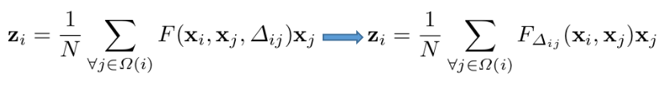
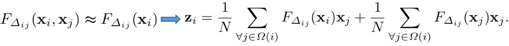
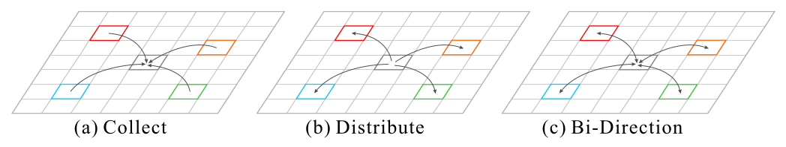
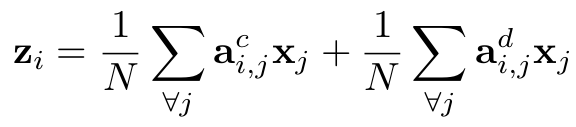
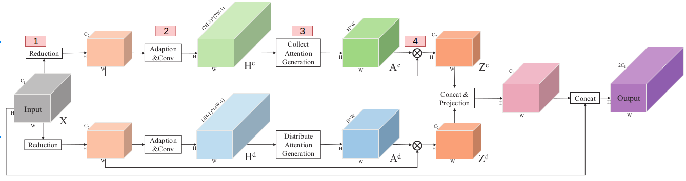
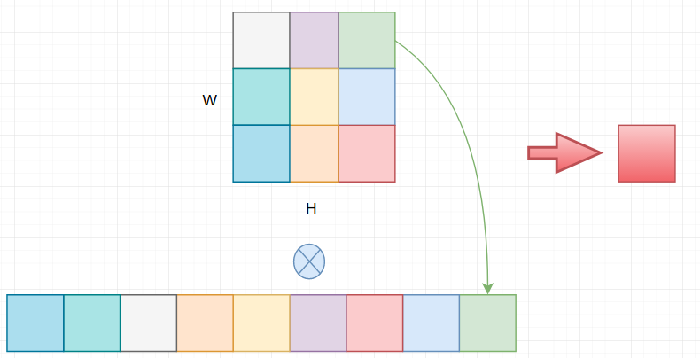
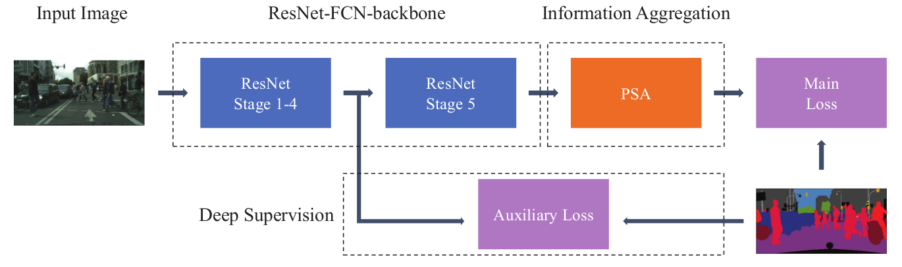
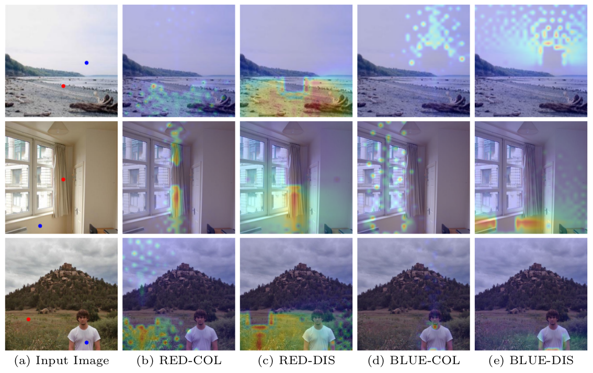

> 论文地址：[PSANet: Point-wise Spatial Attention Network for Scene Parsing](https://hszhao.github.io/papers/eccv18_psanet.pdf)

# PSANet: Point-wise Spatial Attention Network for Scene Parsing

> 作者发现在CNN里面由于卷积滤波器的限制，信息的流动往往被限制在局部区域（即某个点的信息只来源于周边的信息），这就限制了理解复杂场景的能力。这篇论文里面，作者提出了point-wise spatial attention network（PSANet）来缓解只理解局部区域的限制。特征层上的每一个点通过学到的自适应注意力掩码与特征层上其他的点建立联系（掩码可以视为该点与各个点之间关系强弱）。除此之外，在场景分割中信息可以以两路的形式进行传播（这部分看后续介绍就会知道是什么意思）。其他所有点的信息能够被收集起来来帮助当前点，反之亦然，当前点的信息能够"分散"到各个位置来帮助其它点进行预测。作者提出的方法在多个场景分割的数据集上（ADE20K，PASCAL VOC 2012，Cityspaces）均取得了最好的结果，这也说明了该方法的有效性和普遍性。

## 1. 目录

- Attention模块
- 整体结构

## 2. Attention模块

#### 首先给出如何建立"当前点"和其他点的联系

step1：通用形式

> 两边其实是同一种形式的两种表示，$F(x_i,x_j, \Delta_{ij})$表示通过$x_i,x_j$和位置信息来衡量两个位置的相关性；$F$理论上可以有多种不同的定义方式

step2：对$F_{\Delta_{ij}}(x_i, x_j)$进行简化

这形式其实可以看成下图的情况：

> 第一项看成Collect，第二项看成Distribute，合起来看成Bi-Direction

step3：将$F$的具体形式可以是通过卷积学到的"相关性"，所有式子可以更具体的写为：

#### Attention网络模块

由于上下两者结构基本一样，下面就上面的分支来解释：

1. Reduction：对Feature Map进行"Reduction"，通过1x1的卷积来减少维度 --- 主要为了减少后续的计算量（$C_2<C_1$）
2. Over-completed map：通过卷积来获得一个over-completed map（维度为$(2H-1)\times (2W-1)$---大于$H\times W$），你可以将这个通道理解为"过剩"的相关性矩阵
3. attention map：将over-completed map"裁剪"到正常的相关性矩阵（每个位置的通道$H\times W$代表特征层上所有其他点与该点的相关性，即$a_{i,j}$）
4. 计算$\sum a_{i,j}^cx_j$：这部分可以理解为下图的情况：（以$A^c$的单个通道和reduction上某个位置为例---此处将reduction结果画成二维，实际是三维的）
   

> 上述两路合并的时候其实和表达式略有不同：此处采用concat，而式子里用加

## 3. 整体结构

其实和PSP训练方式基本一样，就是将Pyramid Pooling Module替换成PSA模块。

下面再多说两句可视化attention模块是否与实际预期相同：

(b)图我们可以发现"红点"对应区域受其他点影响的区域其实还是满相关的，比如都是窗帘；(c)"红点"影响的区域其实也还是满相关的地方。（此外这两者直接有一种"相辅相成"的感觉，比如右上角"蓝点"红色区域的天空两者结合起来构成更完整的天空）

