> 下述内容来自：[Semantic Segmentation using Fully Convolutional Networks over the years](https://meetshah1995.github.io/semantic-segmentation/deep-learning/pytorch/visdom/2017/06/01/semantic-segmentation-over-the-years.html)
>
> - 翻译的内容可能理解有误，欢迎指出

# 基于Fully Convolutional Networks的语义分割

## 1. 简介

语义分割：将输入图像的每个像素点划分到"对应的语义类别"中。虽然从[2007](http://host.robots.ox.ac.uk/pascal/VOC/voc2007/index.html)开始，就有大量研究者在研究语义分割/场景分析，但是和其他计算机视觉领域一样，巨大的突破来自[2014 Long et. al.](https://arxiv.org/abs/1411.4038)将全卷积网络运用到语义分割中。

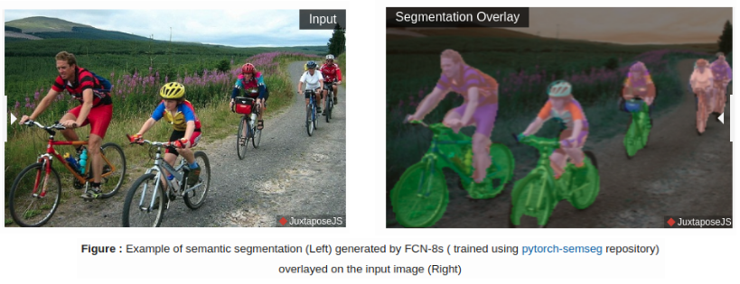

他们采用的[FCN-8s](https://meetshah1995.github.io/semantic-segmentation/deep-learning/pytorch/visdom/2017/06/01/semantic-segmentation-over-the-years.html#sec_fcn)结构在Pascal VOC 2012数据集上取得了62.2% mean IU的成绩（相比之前的方法提升了接近20%的mean IU）。这个结构可以视为语义分割的baseline，其他很多方法都是在改结构上进一步发展和改造的。

FCNs能够被用到自然图像分割，多模态图像分析和多光谱卫星图像分割等领域。非常类似分类网络有非常多不同的结构（例如AlexNet，VGG，ResNet等），语义分割网络也有非常多变种。

作者在这里主要总结了FCN，SegNet，U-Net，FC-Densenet E-Net & Link-Net，RefineNet，PSPNet，Mask-RCNN，以及一些半监督的方法例如DecoupledNet和GAN-SS。以及给出了其中大部分的[PyTorch实现](https://github.com/meetshah1995/pytorch-semseg)。在这篇文章的最后，还会给出一些常用的**数据集**以及可视化部分结果。

## 2. 网络结构

常用的语义分割架构从大概念上可以理解为**encoder network**+**decoder network**。其中的encoder结构往往采用预训练好的分类网络（例如VGG或ResNet --- 注：往往采用的是feature extract部分）。而decoder network (或称之为decoder机制) 主要是将encoder获得的特征映射到像素空间从而获得稠密分类。

> 上述读起来可能有点拗口，简单的理解：encoder部分提取图像的特征，decoder部分根据特征来获得每个像素点的分类

在分类网络中，我们只关注网络最末尾输出的结果（分类概率）。但在语义分割中，我们不仅需要像素层面的区分，还需要将encoder在不同阶段学到的特征映射回像素空间。不同的结构采用不同的机制来进行decoding（如skip connection，pyramid pooling等）

> 保持空间信息的一些方法：
>
> 1. 针对pooling下采样过程中的分辨率损失，采用deconvolution恢复。但是却很难恢复位置信息。
> 2. 使用空洞卷积保持分辨率，增大感受野，但是这么做有两个缺点：A.明显增加了计算代价。B.空洞卷积是一种coarse sub-sampling，因此容易损失重要信息。
> 3. 通过skip connection来产生高分辨率的预测

关于语义分割更多更详细（包括RNN形式的网络）的介绍可以参考：[A Review on Deep Learning Techniques Applied to Semantic Segmentation](https://arxiv.org/pdf/1704.06857.pdf)

### ① Fully Convolution Networks (FCNs) (2015 CVPR)

> 论文地址：[Fully Convolutional Networks for Semantic Segmentation](https://arxiv.org/abs/1411.4038)

> 作者采用"先进的分类网络"（如AlexNet，VGG和GoogleNet等）的全卷积版本，并将其特征提取层迁移到分割任务中，并通过fine-tuning的方式对这部分参数进行更新。同时，设计了一种新颖的结构能够结合浅层语义和高层语义，从而获得精度更高的分割结果。作者的FCN结构在PASCAL VOC上面取得了state-of-the-art的效果（比之前的方法高了20%的mean IU）。

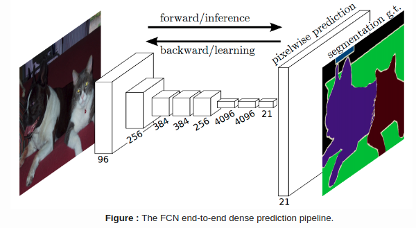

该结构一些核心的地方（主要的创新点）：

- skip connection：将encoder不同"层面"的特征进行融合（这些不同"层面"的特征具有不同"粗糙程度"的语义信息）
- deconvolutions：采用基于双线性插值滤波作为初始值的deconvolutions的方式对"低分辨率"的语义特征进行上采样
- transfer learning：将分类网络的特征提取层迁移到语义分割结构中

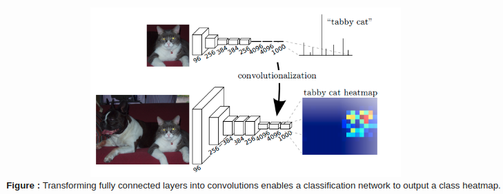

> 上图右边的tabby cat heatmap指的是hxwx1000中的某个像素的全部通道(1x1x1000)

如上图所示，我们将分类网络(如VGG16)的全连接层(fc6和fc7)改为卷积层。那么会产生关于类别的"低分辨率" heatmap，这个heatmap经过上采样(利用deconvolutions)与前面的特征层进行融合(简单的相加 --- 放大2倍与conv4结合，放大4被与conv3结合)。整个结构可以参考：[FCN8s](http://ethereon.github.io/netscope/#/preset/fcn-8s-pascal)

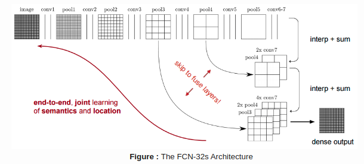

在常规的CNN分类结构中，pooling层能够增大感受野的同时降低feature map的"分辨率"。这在分类中起作用的原因主要在于分类任务中我们只关心图片中是否存在某种物体而不关心该物体具体的位置（即位置不敏感），因此pooling层被引入到每个卷积块的后面，能够帮助随后的卷积块从池化层提取更抽象的特征。

但在语义分割任务中，pooling或者strided convolutions会导致空间信息的丢失。大部分后续的分割结构都是在decoder上面试图"修复"因为encoder过程下采样所导致的信息损失。正如上图所示，在FCN-8s中，通过融合encoder阶段不同"层"对应的不同"分辨率"的信息（conv3，conv4和fc7）来增强空间和特征信息，从而加强分割效果。

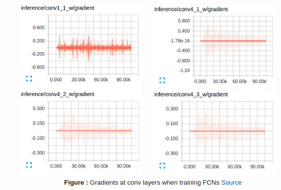

第一个卷积层捕获浅层的几何空间信息，主要通过调整浅层结构的参数来调整模型去适应整个数据集（你可以发现上图1_1的梯度在训练过程中调整较大）。而深层的结构在fune-tunning的过程中调整较小（上面图中的conv4_1, conv4_2, conv4_3），这主要是因为分类网络中深层的结构本身提取的语义信息对分割而言本身就已经足够好了（注：估计是因为这两个数据集之间有很大的相似性---比如你迁移到医学图像上面或许就没此情况了）。这情况也让我们看到迁移学习多么强大的功效。

> **Left :** Deconvolution (Transposed Convolution) and **Right :** Dilated (Atrous) Convolution

> 关于Deconvolution更"数值化"的解释如下图所示：
>
> 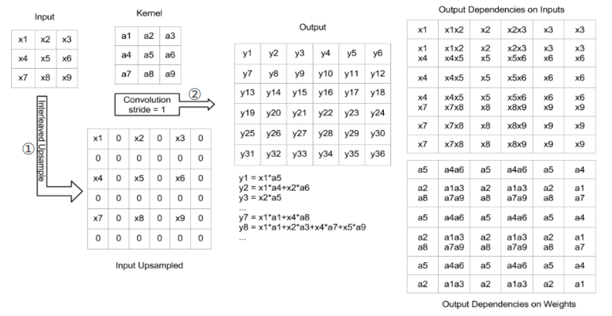

在语义分割架构中，另一个非常重要的机制是通过deconvolutions的方法将"低分辨率"的特征上采样到与输入图片同等"分辨率"，或者为了避免"分辨率"的下降在encoder阶段采用dilated convolutions（需要付出一定的计算代价）。dilated convolutions的开销往往是巨大的，即使是在现代的GPUs上面。关于deconvolutions更详细的介绍和解释可以参考：[Deconvolution and Checkerboard Artifacts](https://distill.pub/2016/deconv-checkerboard/)

### ② SegNet (2015) 

> 论文地址：[SegNet: A Deep Convolutional Encoder-Decoder Architecture for Image Segmentation](https://arxiv.org/abs/1511.00561)

> SegNet的主要创新点在于将decoder上"低分辨率"的特征上采样的方式。decoder"找到"与encoder对应的"分辨率"上采用的pool时对应的下标来进行上采样（下面会有张图说明）。这就省去了上采样的学习过程。获得的上采样maps会是稀疏的，然后通过后续的卷积学习来获得稠密的feature maps。作者比较了该结构和FCN，DeepLab-LargeFOV，DeconvNet结构，该结构能够同时兼顾内存和准确率，并在语义分割上取得很好的效果

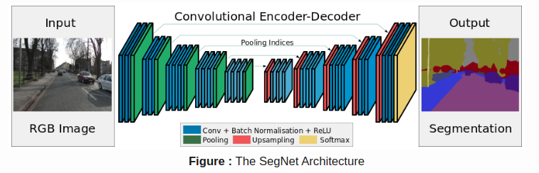

该结构的一些主要创新点：

- SegNet采用unpooling来对decoder上的特征层进行上采样，从而来保持分割中的空间信息
- encoder并没有任何全连接层，因此所需的参数量更少（轻量级网络）

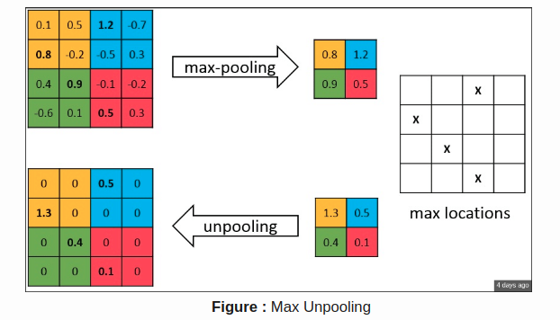

如上图所示：在encoder阶段记录下来max-pooling层对应的下标，之后在decoder阶段进行上采样时，利用记录的下标来帮助进行上采样。虽然这能够帮助保留高频信息，但是在对"低分辨率"的feature maps进行unpooling会缺乏"邻近信息"。

### ③ U-Net (2015 MICCAI)

> 论文地址：[U-Net: Convolutional Networks for Biomedical Image Segmentation](https://arxiv.org/abs/1505.04597)

> 该结构由一条"收缩路径"（主要捕获特征信息）和一条"扩展路径"（主要帮助获取更精准的空间信息）。作者说明在针对电子显微镜下神经元结构的分割的ISBI比赛中，这种网络结构只需少量的数据进行端到端的学习就能够超过之前最好的方法（基于滑动窗的卷积网络）。采用同样的网络结构在透射光显微镜图像上作者同样取得了第一名，并且比第二名高了一大截。除此之外，该网络结构非常块，在GPU上，分割一张512x512的图像所需的时间少于1s。

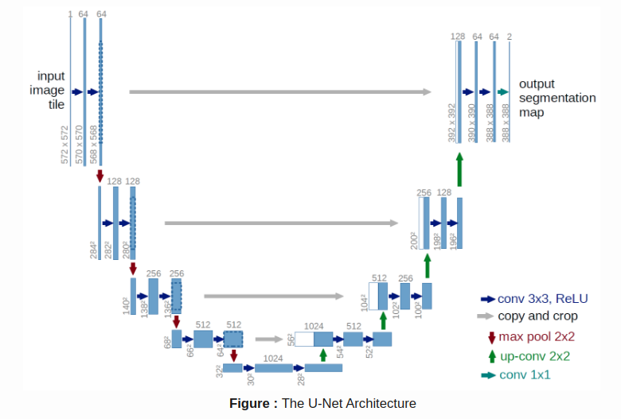

主要的创新点：

- U-Net简单地将**encoder的特征层**与进行了**上采样的对应"分辨率"decoder的特征层**进行concat操作，从而形成"阶梯结构"。这种网络结构非常类似[Ladder Networks](https://arxiv.org/abs/1507.02672)结构
- 该结构通过concatenation的连接方式，从而允许不同阶段的decoder层能够"弥补"encoder因为pooled等操作而丢失的信息（因为这部分信息包含在与之进行concat的encoder对应层）

U-Net在只包含了30幅标注了的医学图像上（EM Stacks数据集）以及一些其他医学图像数据集上取得了state-of-art的结果，以及扩展的[3D-U-Net](https://arxiv.org/abs/1606.06650)。虽然U-Net最初是试验在医学图像上面，但是发现在其他一些领域，例如卫星图像分割上面也取得了非常好的效果。

### ④ Fully Convolutional DenseNets (2016)

> 论文地址：[The One Hundred Layers Tiramisu: Fully Convolutional DenseNets for Semantic Segmentation](https://arxiv.org/abs/1611.09326)

> 在这篇文章中，作者将DenseNets扩展到语义分割问题上面，并且在不加任何后处理模块和预训练的情况下，在城市场景基准数据集（例如CamVid和Gatech）上面取得了state-of-the-art的效果。此外，得益于DenseNet的优良结构，作者提出的方法相比其他网络结构所需的参数更少。

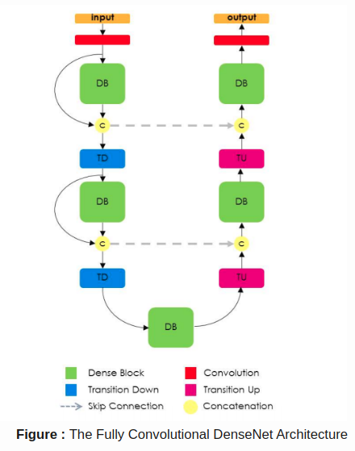

Fully Convolutional DenseNet采用[DenseNet](https://arxiv.org/abs/1608.06993)作为encoder的基础架构，并且采用和U-Net类似的concat方式来对encoder和decoder的特征进行结合。

### ⑤ E-Net和Link Net (2016&2017)

> 论文地址：
>
> 1. [ENet: A Deep Neural Network Architecture for Real-Time Semantic Segmentation](https://arxiv.org/abs/1606.02147)
> 2. [LinkNet: Feature Forwarding: Exploiting Encoder Representations for Efficient Semantic Segmentation](https://codeac29.github.io/projects/linknet/)

> 在这篇文章中，作者提出了一种新的网络结构---称之为ENet（efficient neural network），主要是为了那些需要较少潜在操作的任务（即对效率考虑更多的任务）。ENet相较于目前存在的一些分割结构，在速度上快18x，FLOPs少了75x，参数量少了79x，并且能够达到相近甚至更好的准确率！作者在CamVid，Cityspaces和SUN数据集上均取得了和目前state-of-the-art方法相近的准确率，并且在速度和准确率上面取得了很好的"权衡"

> LinkNet能够在TX1和Titan X上面分别以2fps和19fps的速度处理大小为1280x720的图像 --- fps：每秒传输帧数

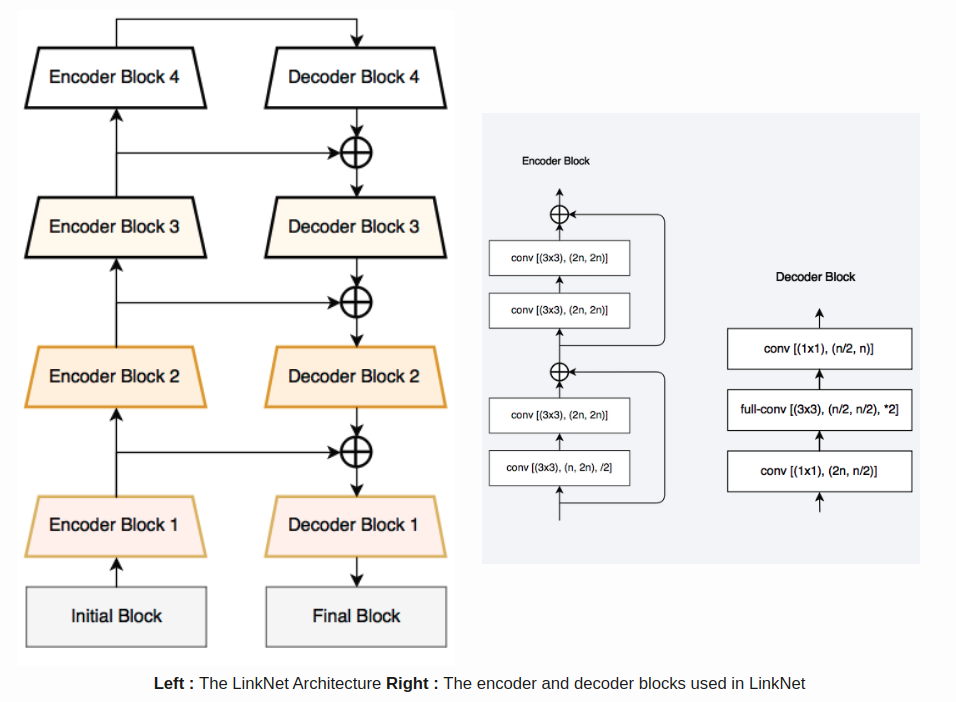

LinkNet结构非常类似[ladder network](https://arxiv.org/abs/1507.02672)结构，其中encoder支路的feature map和decoder支路上面经过上采样的对应upsampled feature maps进行融合（sum操作）。值得一提的是：decoder块通过channel reduction的方案使得这部分的参数量大量减少 --- 对于大小为$[H,W,n\_channels]$的特征层，先经过$1\times 1$的卷积"消除冗余通道"获得$[H,W,n\_channels/4]$，然后利用deconvolution操作获得$[2*H,2*W,n\_channels/4]$，之后再利用$1\times 1$的卷积获得$[2*H,2*W,n\_channels/2]$的feature map。这种网络结构与当前state-of-the-art的分割结构具有相近的性能，并且能够使得分割在"嵌入式GPU"上面进行实时分割。

### ⑥ Mask R-CNN

> 论文地址：[Mask R-CNN ](https://arxiv.org/abs/1703.06870)（注：这篇其实应该属于Instance Segmentation，而不是语义分割范畴）

> 这篇论文在提出了Mask R-CNN结构，在原有的Faster R-CNN结构上增加了一个"目标掩码"（object mask）的分支。Mask R-CNN非常容易训练，仅仅只是在Faster R-CNN里面加了一个overhead用于"掩码"而已，运行速度达到5fps。此外，Mask R-CNN非常容易扩展到其他任务上面（比如，我们可以用相同的框架进行人体姿态估计）。作者在三个比赛中（instance segmentation, bounding-box object detection和person keypoint detection）均取得了第一名。

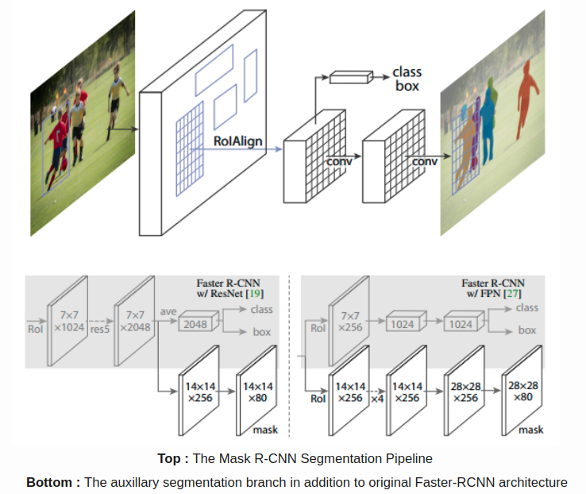

整个Mask R-CNN结构非常简单，就是Faster R-CNN的扩展，主要做了部分修改为了获得更好的分割性能。

一些关键的地方：

- 在Faster R-CNN基础上增加了额外的分支用来做语义分割（如上图的bottom所示，两者皆可）
- 将RoIPool替换为RoIAlign，从而能够避免特征提取时的空间量化带来的信息丢失（这对分割影响很大）
- Mask R-CNN结合了FPN结构，在MS COCO数据集上取得了state-of-the-art的结果

> 关于更细节的可以参考：[Mask-RCNN](https://blog.csdn.net/linolzhang/article/details/71774168)
>
> 这里多写几点上述博客的内容：
>
> 1. 上图bottom的两种结合方式其实都是可以的，旨在说明作者所提出的Mask RCNN 方法的泛化适应能力 - 可以和多种 RCNN框架结合，表现都不错
>
> 2. Loss Function：每个 ROIAlign 对应$K * m^2$ 维度的输出。**K 对应类别个数，即输出 K 个mask**，m对应 池化分辨率（7*7）。Loss 函数定义：
>    $$
>    L_{mask}(Cls_k)=sigmoid(Cls_k)
>    $$
>    **平均二值交叉熵 （average binary cross-entropy）Loss，通过逐像素的 Sigmoid 计算得到。**通过对每个 Class 对应一个 Mask 可以有效避免类间竞争（其他 Class 不贡献 Loss ）

### ⑦ PSPNet (2017 CVPR)

> 论文地址：[PSPNet: Pyramid Scene Parsing Network](https://arxiv.org/abs/1612.01105)

> 在这篇文章中，作者主要利用Pyramid pooling module来整合不同区域的context从而获取全局的context，整个结构称之为pyramid scene parsing network (PSPNet)。作者采用的结构在场景解析任务中取得了非常好的效果，且这种结构对像素级别预测的任务是非常有效的。该方法在非常多的数据集上都取得了state-of-the-art的表现。并且在ImageNet场景解析，PASCAL VOC2012和Cityspaces均取得了第一名。

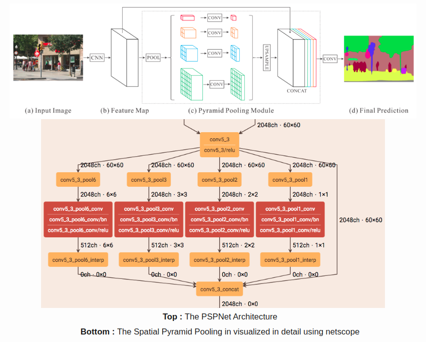

这篇文章的主要创新点：

- PSPNet对基础结构ResNet的卷积采用dilated convolution。且在整个encoder部分，特征经过最初的pooling之后一直保持相同的"分辨率"（为原输入图像的1/4），直到进入spatial pooling module
- 在训练时引入了auxillary loss来帮助ResNet学习（这部分其实只是训练的一个小技巧）
- 引入Spatial Pyramid Pooling模块来整合不同区域的context从而获取更好的全局context

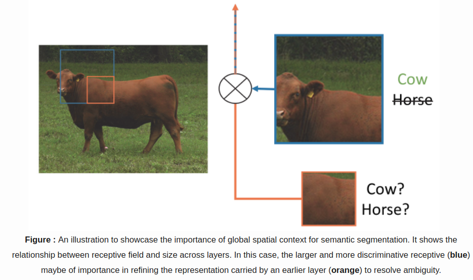

PSPNet是目前CitySpaces，ADE20K和Pascal VOC2012上面的state-of-the-art的方法。

> 场景分割中的一些难点（部分或者完全和上下文关系以及全局信息有关）：
>
> 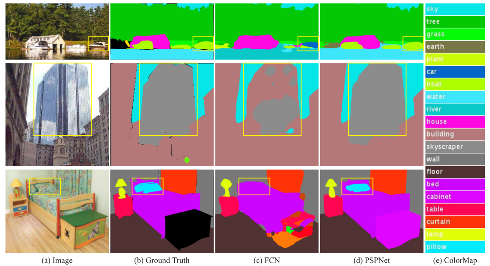
>
> 1. 类别间错误的匹配关系：物体往往与场景之间有密切的联系(这就说明要结合场景来区分其中的物体---暗含需要尽可能的全局信息)。如上图第一行中框出来的是船（因为在湖上面）而不是车。
> 2. 类别之间太相似：在一些场景中，有些物体是非常相近的（如mountain和hill等），此时就非常容易将其误分。如上图中第二行中既有skyscraper，又有building。解决方法往往是通过运用类别之间的相关性（可以理解为和周边物体的一致性？）
> 3. 不显眼的类别：某些类别非常不显著（如第三行中的枕头），此时往往需要更加小的感受野来发现这些不显眼的物体

### ⑧ RefineNet (2017 CVPR)

> 论文地址：[RefineNet: Multi-Path Refinement Networks for High-Resolution Semantic Segmentation](https://arxiv.org/abs/1611.06612)

> 在这篇文章中，作者提出了RefineNet，将粗糙的高层语义特征和细粒度的低层特征融合。

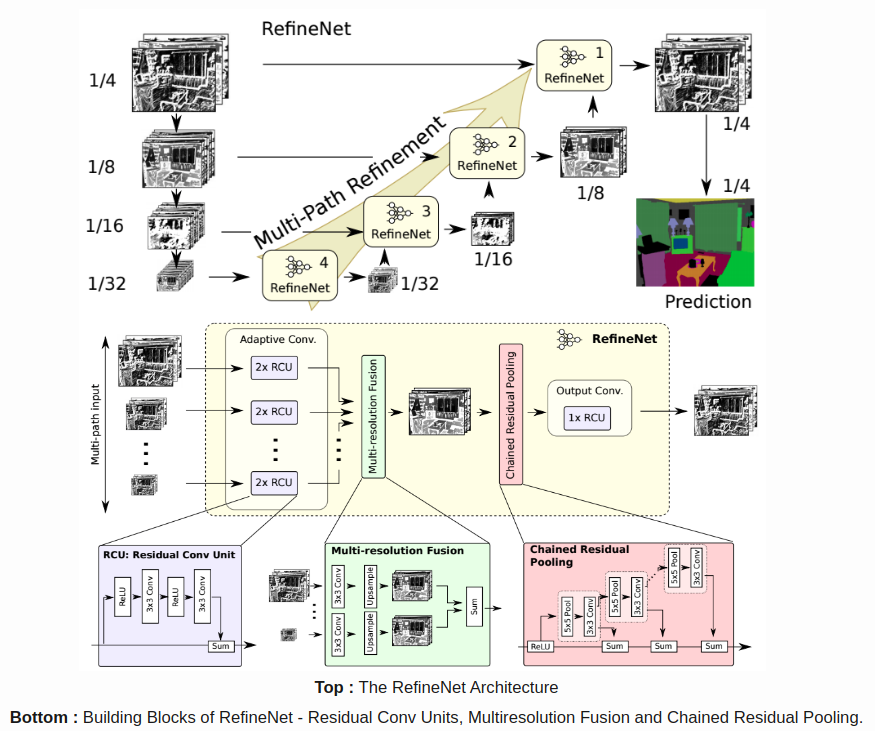

RefineNet解决空间信息丢失的手段和PSPNet（采用计算代价更高的dilated convolutions）是非常不同的。作者采用RefineNet blocks不断增大"池化后"的特征的分辨率，最后产生高分辨率的segmentation map。

该架构的一些特点：

- multiple resolutions：采用多种不同分辨率的输入，对提取的特征进行融合，并将其作为下一阶段的输入。
- Chained Residual Poolinhg：引入了Chained Residual Pooling，能够从图片大块区域中捕获背景信息。相当于对特征采用不同大小的窗进行池化并采用residual connections将其进行融合。
- 所有的特征融合均采用`sum`操作，从而允许端到端的训练
- 采用原始的ResNet而不是dilated convolutions

> 如果不是非常理解的话，可以参考：[RefineNet](https://zhuanlan.zhihu.com/p/37805109)

### ⑨ G-FRNet (2017 CVPR)

> 论文地址：[G-FRNet: Gated Feedback Refinement Network for Dense Image Labeling](http://www.cs.umanitoba.ca/~ywang/papers/cvpr17.pdf)

> 在这篇文章中，作者提出了Gated Feedback Refinement Network (基于门控反馈的细化网络，G-FRNet)，一种针对稠密分类任务的端到端的网络结构。最初，GFRNet获得一个粗糙的预测结果，然后在refinement阶段通过高效的结合局部和全局的特征来不断修正和加强细节（不断完善分割结果）。作者引入了一个门控单元来控制前向信息的传输，从而能够帮助过滤掉一些"歧义"信息

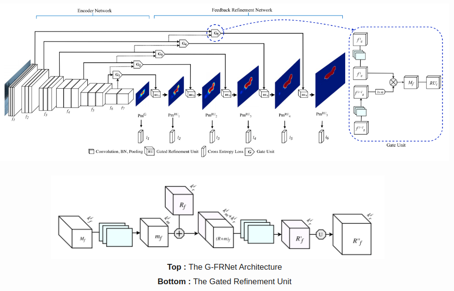

上述结构主要依赖于将encoder上面的特征与decoder上面的特征进行融合，主要采用`concat`，`unpooling`和简单的`sum`。但是，将encoder"高分辨率"的特征和decoder经过上采样的特征进行融合，可能存在的一个问题---"encoder"上面的某些特征对分割可能有意义，也可能没意义。因此通过门控来"把控"从encoder传输过来的信息，从而消除encoder上面特征一些"有歧义或无"的信息。

> 这篇论文里面的实验说在分割任务中，ResNet相比VGG16是更好的encoder结构。但这篇博客的博主没有在其他文章中看到这个情况。

## 3. Datasets

| Dataset                                                      | Training | Testing | #Classes |
| ------------------------------------------------------------ | -------- | ------- | -------- |
| [CamVid](http://mi.eng.cam.ac.uk/research/projects/VideoRec/CamVid/) | 468      | 233     | 11       |
| [PascalVOC 2012](http://host.robots.ox.ac.uk/pascal/VOC/voc2012/) | 9963     | 1447    | 20       |
| [NYUDv2](http://cs.nyu.edu/~silberman/datasets/nyu_depth_v2.html) | 795      | 645     | 40       |
| [Cityscapes](https://www.cityscapes-dataset.com/)            | 2975     | 500     | 19       |
| [Sun-RGBD](http://rgbd.cs.princeton.edu/)                    | 10355    | 2860    | 37       |
| [MS COCO ‘15](http://mscoco.org/)                            | 80000    | 40000   | 80       |
| [ADE20K](http://groups.csail.mit.edu/vision/datasets/ADE20K/) | 20210    | 2000    | 150      |

## 4. Results

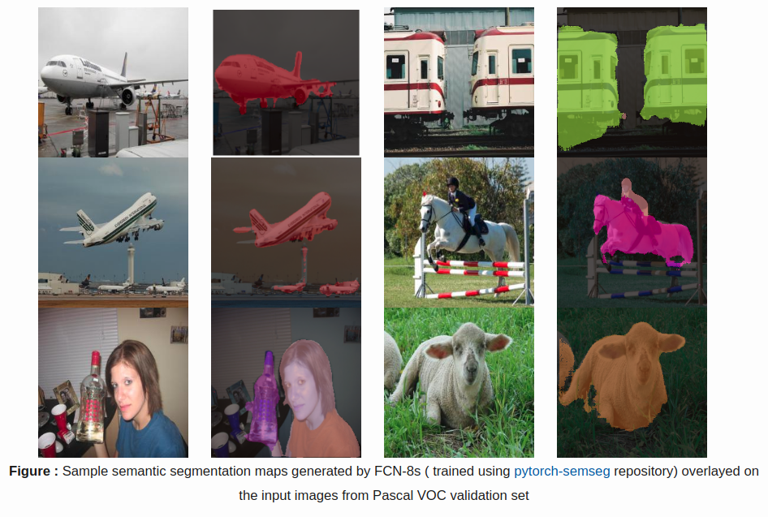

